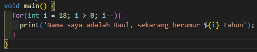
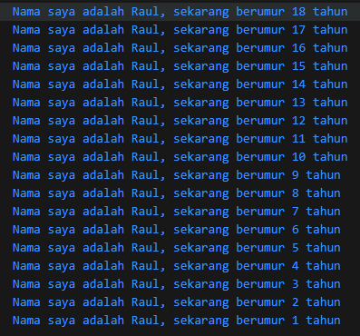
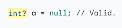
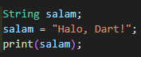

# Pertemuan 2 Pengantar Bahasa Pemrograman Dart - Bagian 1

**Nama : Raudhil Firdaus Naufal** 

**NIM : 2341720164**  

**Kelas : TI-3G**

# Soal 1

**Modifikasilah kode pada baris 3 di VS Code atau Editor Code favorit Anda berikut ini agar mendapatkan keluaran (output) sesuai yang diminta!**

Output
    

# Soal 2

**Mengapa sangat penting untuk memahami bahasa pemrograman Dart sebelum kita menggunakan framework Flutter ? Jelaskan!**

Karena bahasa pemrograman Dart merupakan inti dari Framework Fluter, oleh karena itu, sebelum bekerja dengan flutter, kita perlu mengetahui asal usul bahasa Dart, kelebihannya, dan kenapa bahasa Dart dipakai.

# Soal 3

**Rangkumlah materi dari codelab ini menjadi poin-poin penting yang dapat Anda gunakan untuk membantu proses pengembangan aplikasi mobile menggunakan framework Flutter.**

Dart merupakan inti yang akan digunakan untuk Framework Flutter, Dart bertujuan untuk menggabungkan kelebihan-kelebihan dari sebagian besar bahasa tingkat tinggi dengan fitur-fitur bahasa pemrograman terkini, seperti:

-Productive tooling
-Garbage collection
-Type annotations (opsional)
-Statically typed
-Portability

Dart memiliki perkakas yang modern dan stabil yang telah disediakan oleh plugin IDE. Hal ini telah dirancang untuk mendapatkan performa terbaik dengan tetap menjaga nuansa bahasa yang dinamis, Dart juga dapat menyeimbangkan dua fitur utama yaitu fleksibilitas dan ketangguhan.

Kode Dart dapat dieksekusi pada lingkungan yang mendukung bahasa Dart seperti berikut:

-Runtime systems
-Dart core libraries
-Garbage collectors

Eksekusi kode Dart dapat beroperasi dalam dua mode:

-kompilasi Just-In-Time (JIT)
-Kompilasi Ahead-Of-Time (AOT)

Dart dirancang untuk object-oriented (OO). Secara singkat, Bahasa OOP didasarkan pada konsep objek yang menyimpan kedua data (disebut fields) dan kode (disebut methods). Objek-objek ini dibuat dari cetak biru yang disebut class yang mendefinisikan field dan method yang akan dimiliki oleh sebuah objek.

Dart hadir dengan banyak operator typical yang bekerja seperti banyak bahasa pemrograman lainnya; yaitu sebagai berikut:

(+) untuk tambahan.

(-) untuk pengurangan.

(*) untuk perkalian.

(/) untuk pembagian.

(~/)  untuk pembagian bilangan bulat. Di Dart, setiap pembagian sederhana dengan / menghasilkan nilai double. Untuk mendapatkan nilai bilangan bulat, Anda perlu membuat semacam transformasi (yaitu, typecast) dalam bahasa pemrograman lain; namun Dart sudah mendukung untuk operasi ini.

(%) untuk operasi modulus (sisa bagi dari bilangan bulat).

(-expression) untuk negasi (yang membalikkan suatu nilai).

dan lainnya.

# Soal 4

**Buatlah penjelasan dan contoh eksekusi kode tentang perbedaan Null Safety dan Late variabel !**

Null safety adalah agar kita bisa menentukan jika sebuah nilai boleh null atau tidak dengan cara menambahkan (?)

Contoh:

Late Variabel digunakan untuk menentukan kalau variabel nanti pasti akan diisi, digunakan dengan cara menambahkan 'late' sebelum variabel 

Contoh:

