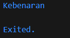

# Pengantar Bahasa Pemrograman Dart - Bagian 2

**Nama : Raudhil Firdaus Naufal** 

**NIM : 2341720164**  

**Kelas : TI-3G**

# Soal 1 Silakan selesaikan Praktikum 1 sampai 3, lalu dokumentasikan berupa screenshot hasil pekerjaan beserta penjelasannya!

# Praktikum 1

**Langkah 1: Ketik atau salin kode program berikut ke dalam fungsi main().**

**Langkah 2: Silakan coba eksekusi (Run) kode pada langkah 1 tersebut. Apa yang terjadi? Jelaskan!**

Output:

Yang terjadi adalah, kode menetapkan variabel test dengan value test2, nah lalu dilakukan operator kondisional yaitu if/else, dan dilakukan pemilihan test dengan value yang diinginkan, karena value test adalah test2 maka outputnya adalah Test2, lalu dilakukan operator kondisional sekali lagi, karena test valuenya test2 maka output selanjutnya adalah Test2 again yang sesuai dengan gambar diatas.

**Langkah 3: Tambahkan kode program berikut, lalu coba eksekusi (Run) kode Anda.**

Output:

**Apa yang terjadi ? Jika terjadi error, silakan perbaiki namun tetap menggunakan if/else.**

Yang terjadi adalah error, karena operator kondisional menentukan value test seharusnya sebagai boolean, tetapi tipe data test adalah string yang dimana itu tidak tepat, sehingga tipe data test harus diubah menjadi boolean.

Output:

Penjelasan: test akan mengeluarkan output kebenaran, karena test adalah true.

# Praktikum 2

**Langkah 1: Ketik atau salin kode program berikut ke dalam fungsi main().**

**Langkah 2: Silakan coba eksekusi (Run) kode pada langkah 1 tersebut. Apa yang terjadi? Jelaskan! Lalu perbaiki jika terjadi error.**

Yang terjadi adalah error, karena counter belum ditentukan variabel dan nilainya.

Perbaikan:

Output:

**Langkah 3: Tambahkan kode program berikut, lalu coba eksekusi (Run) kode Anda.**

**Apa yang terjadi ? Jika terjadi error, silakan perbaiki namun tetap menggunakan do-while.**

Yang terjadi adalah error karena counter belum ditentukan variabel dan nilainya.

Perbaikan:

Output:

Penjelasan: Variabel counter di berikan nilai 1, dan dilakukan perulangan, selama counter masih dibawah 77, maka counter akan terus diprint.

# Praktikum 3

**Langkah 1: Ketik atau salin kode program berikut ke dalam fungsi main().**

**Langkah 2: Silakan coba eksekusi (Run) kode pada langkah 1 tersebut. Apa yang terjadi? Jelaskan! Lalu perbaiki jika terjadi error.**

Yang terjadi adalah error, pertama adalah karena index belum ditentukan tipe datanya, yang kedua adalah beberapa variabel tidak sama penulisannya.

Perbaikan:

Output:

**Langkah 3: Tambahkan kode program berikut di dalam for-loop, lalu coba eksekusi (Run) kode Anda.**

Output:

**Apa yang terjadi ? Jika terjadi error, silakan perbaiki namun tetap menggunakan for dan break-continue.**

Yang terjadi adalah error, karena break dan continue hanya bisa digunakan oleh looping for, while dan do while. Tidak bisa digunakan di if/else, kecuali if/else ada di looping yang disebutkan sebelumnya.

Perbaikan:

Output:

Penjelasan: outputnya adalah seperti gambar diatas, karena pada perulangan tersebut, dilakukan pengulangan dari 0 sampai 26, tetapi didalam for tersebut ada if else, yang dimana, ketika index=21, maka akan berhenti, oleh karena itu output berhenti di 20, karena print ada di akhir, dan juga 2-6 tidak ada karena setiap index ada diantara 2 sampai 6 maka akan diskip.

# Soal 2 Buatlah sebuah program yang dapat menampilkan bilangan prima dari angka 0 sampai 201 menggunakan Dart. Ketika bilangan prima ditemukan, maka tampilkan nama lengkap dan NIM Anda.

Kode:

Output:

# Soal 3 Kumpulkan berupa link commit repo GitHub pada tautan yang telah disediakan di grup Telegram!

**👍👍👍👍👍👍👍**

