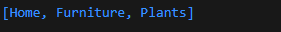

# Pengantar Bahasa Pemrograman Dart - Bagian 3

**Nama : Raudhil Firdaus Naufal** 

**NIM : 2341720164**  

**Kelas : TI-3G**

# Soal 1 Silakan selesaikan Praktikum 1 sampai 5, lalu dokumentasikan berupa screenshot hasil pekerjaan Anda beserta penjelasannya!

# Praktikum 1: Eksperimen Tipe Data List

**Langkah 1: Ketik atau salin kode program berikut ke dalam void main().**

**Langkah 2: Silakan coba eksekusi (Run) kode pada langkah 1 tersebut. Apa yang terjadi? Jelaskan!**

Yang terjadi adalah, yang pertama kita ngeprint panjang list yaitu 3, lalu ngeprint list pada urutan ke 2 yaitu 2, lalu kita menjadikan list urutan ke 2 jadi 1, setelah itu diprint lagi list yang urutan ke-2, yang menjadikan outputnya pada gambar diatas

**Langkah 3: Ubah kode pada langkah 1 menjadi variabel final yang mempunyai index = 5 dengan default value = null. Isilah nama dan NIM Anda pada elemen index ke-1 dan ke-2. Lalu print dan capture hasilnya.**

Hasilnya error

**Apa yang terjadi ? Jika terjadi error, silakan perbaiki.**

Yang terjadi adalah error, karena variabel list, di default nilainya sebagai null, oleh karena itu saat mengisi nilai string, menjadi error, sehingga harus di tentukan variabel final listnya.

Output:

# Praktikum 2: Eksperimen Tipe Data Set

**Langkah 1: Ketik atau salin kode program berikut ke dalam fungsi main().**

**Langkah 2: Silakan coba eksekusi (Run) kode pada langkah 1 tersebut. Apa yang terjadi? Jelaskan! Lalu perbaiki jika terjadi error.**

Yang terjadi adalah, kode memberikan output seperti gambar diatas, karena setelah dimasukkan nilai dari halogens, lalu diprint, maka akan memberikan output semuan nilai halogens. Tidak ada error.

**Langkah 3: Tambahkan kode program berikut, lalu coba eksekusi (Run) kode Anda.**

**Apa yang terjadi ? Jika terjadi error, silakan perbaiki namun tetap menggunakan ketiga variabel tersebut. Tambahkan elemen nama dan NIM Anda pada kedua variabel Set tersebut dengan dua fungsi berbeda yaitu .add() dan .addAll(). Untuk variabel Map dihapus, nanti kita coba di praktikum selanjutnya.**

Tidak terjadi error, tetapi output pada gambar diatas karena belum ada nilai dari masing masing variabel.

Perbaikan:

Output:

# Praktikum 3: Eksperimen Tipe Data Maps

**Langkah 1: Ketik atau salin kode program berikut ke dalam fungsi main().**

**Langkah 2: Silakan coba eksekusi (Run) kode pada langkah 1 tersebut. Apa yang terjadi? Jelaskan! Lalu perbaiki jika terjadi error.**

Yang terjadi adalah, kode pada langkah pertama memberikan nilai pada variabel gifts yaitu dengan key string, sementara noblegases dengan key int, dan untuk nial value, diberikan bisa berupa string dan int, sehingga saat di print, akan melakukan output seperti gambar diatas.

**Langkah 3: Tambahkan kode program berikut, lalu coba eksekusi (Run) kode Anda.**

**Apa yang terjadi ? Jika terjadi error, silakan perbaiki.**

Yang terjadi adalah, hasilnya masih sama seperti sebelumnya, karena untuk menghasilkan outputnya belum diganti

**Tambahkan elemen nama dan NIM Anda pada tiap variabel di atas (gifts, nobleGases, mhs1, dan mhs2). Dokumentasikan hasilnya dan buat laporannya!**

Output:

# Praktikum 4: Eksperimen Tipe Data List: Spread dan Control-flow Operators

**Langkah 1: Ketik atau salin kode program berikut ke dalam fungsi main().**

**Langkah 2: Silakan coba eksekusi (Run) kode pada langkah 1 tersebut. Apa yang terjadi? Jelaskan! Lalu perbaiki jika terjadi error.**

Yang terjadi adalah, variabel list memberi value 1,2,3 lalu list 2, memasukkan value 0, lalu dilanjutkan dengan valuenya list1, oleh karena itu saat diprint, output dari list2 adalah 0,1,2,3 sementara list1 1,2,3 dan juga karena list2 memiliki value list1 juga maka length dari list2 adalah 4. 

**Langkah 3: Tambahkan kode program berikut, lalu coba eksekusi (Run) kode Anda.**

**Apa yang terjadi ? Jika terjadi error, silakan perbaiki.**

Yang terjadi adalah, list3 mengambil value dari list1, dan dengan memakai ...? maka akan diambil selama tidak null, karena lsit1 ada nilai 1 dan 2, maka semuanya akan diambil, termasuk null, oleh karena itu saat diambil length dari list3, maka nilainya 4.

**Tambahkan variabel list berisi NIM Anda menggunakan Spread Operators. Dokumentasikan hasilnya dan buat laporannya!**

Output:

**Langkah 4: Tambahkan kode program berikut, lalu coba eksekusi (Run) kode Anda.**

Hasilnya error

**Apa yang terjadi ? Jika terjadi error, silakan perbaiki. Tunjukkan hasilnya jika variabel promoActive ketika true dan false.**

Yang terjadi adalah error karena promoActive belum dideklarasikan

Output True:

Output False:

**Langkah 5: Tambahkan kode program berikut, lalu coba eksekusi (Run) kode Anda.**

Hasilnya error

**Apa yang terjadi ? Jika terjadi error, silakan perbaiki. Tunjukkan hasilnya jika variabel login mempunyai kondisi lain.**

Yang terjadi adalah error karena login belum dideklarasikan

Perbaikan dengan login menggunakan kondisi lain

Output:

**Langkah 6: Tambahkan kode program berikut, lalu coba eksekusi (Run) kode Anda.**

Output:

**Apa yang terjadi ? Jika terjadi error, silakan perbaiki. Jelaskan manfaat Collection For dan dokumentasikan hasilnya.**

Yang terjadi adalah, listofints memberi value 1-3, lalu listofstrings memberikan value #0, dan juga setiap variable di listofints diberi nama i, lalu diberikan # disetiap inya, lalu dicek apakah listofstrings di posisi ke 1 adalah #1, dan setelah benar, di print listofstrings yang memberikan output diatas.

Collection for adalah fitur Dart yang memungkinkan kita membuat list,set atau map secara lebih ringkas

# Praktikum 5: Eksperimen Tipe Data Records

**Langkah 1: Ketik atau salin kode program berikut ke dalam fungsi main().**

**Langkah 2: Silakan coba eksekusi (Run) kode pada langkah 1 tersebut. Apa yang terjadi? Jelaskan! Lalu perbaiki jika terjadi error.**

Yang terjadi adalah, dart sekarang memiliki aturan, yang dimana positional akan keluar duluan baru field pada output, oleh karena itu, last keluar setelah first.

**Langkah 3: Tambahkan kode program berikut di luar scope void main(), lalu coba eksekusi (Run) kode Anda.**

**Apa yang terjadi ? Jika terjadi error, silakan perbaiki. Gunakan fungsi tukar() di dalam main() sehingga tampak jelas proses pertukaran value field di dalam Records.**

Output:

Yang terjadi adalah, dengan menggunakan fungsi tukar, value record tertukar sesuai dengan ketentuan yang dibuat di fungsi tukar.

**Langkah 4: Tambahkan kode program berikut di dalam scope void main(), lalu coba eksekusi (Run) kode Anda.**

**Apa yang terjadi ? Jika terjadi error, silakan perbaiki. Inisialisasi field nama dan NIM Anda pada variabel record mahasiswa di atas. Dokumentasikan hasilnya dan buat laporannya!**

Yang terjadi adalah error karena variable mahasiswa masih null.

Perbaikan:

Output:

**Langkah 5: Tambahkan kode program berikut di dalam scope void main(), lalu coba eksekusi (Run) kode Anda.**

**Apa yang terjadi ? Jika terjadi error, silakan perbaiki. Gantilah salah satu isi record dengan nama dan NIM Anda, lalu dokumentasikan hasilnya dan buat laporannya!**

Perbaikan:

Output:

Yang terjadi adalah, variable mahasiswa memberikan nilai berupa String dan juga value, saat string diambil, maka akan output string, sementara saat value diambil, maka akan mengambil nilai dari value tersebut, oleh karena itu output seperti gambar diatas.

# Soal 2 Jelaskan yang dimaksud Functions dalam bahasa Dart!

Fungsi dalam bahasa dart adalah sebuah kode yang dibuat sesuai nama, untuk dilakukan perintah, dan namanya biasanya melambangkan fungsi tersebut.

# Soal 3 Jelaskan jenis-jenis parameter di Functions beserta contoh sintaksnya!

Ada 4 Jenis Parameter:

1. Positional Parameter = Parameter Wajib Berurutan

2. Optional Positional Parameter = Boleh diisi atau tidak

3. Named Parameter = Dipanggil berdasarkan nama parameter

4. Default Parameter Value = Memberikan nilai default jika tidak ada input

# Soal 4 Jelaskan maksud Functions sebagai first-class objects beserta contoh sintaknya!

Maksud functions sebagai first class objects adalah function diberlakukan sama seperti objek lain

contoh:

# Soal 5 Apa itu Anonymous Functions? Jelaskan dan berikan contohnya!

Anonymouse functions adalah fungsi tanpa nama, biasanya digunakan untuk sekali pakai atau langsung dikirim sebagai parameter ke fungsi lain.

contoh:

# Soal 6 Jelaskan perbedaan Lexical scope dan Lexical closures! Berikan contohnya!

Lexical scope adalah sebuah fungsi yang bisa mengakses variable berdasarkan posisi penulisannya

contoh:

Lexical closure adalah fungsi yang bisa membawa variable dari scope luar, lalu mengingatnya walaupun scope luar sudah selesai dipanggil

contoh:

# Soal 7 Jelaskan dengan contoh cara membuat return multiple value di Functions!

Berikut adalah contoh return multiple value di functions dengan list

Output:

**Kumpulkan berupa link commit repo GitHub kepada dosen pengampu sesuai kesepakatan di kelas!**

