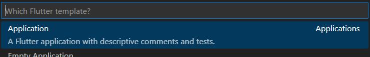
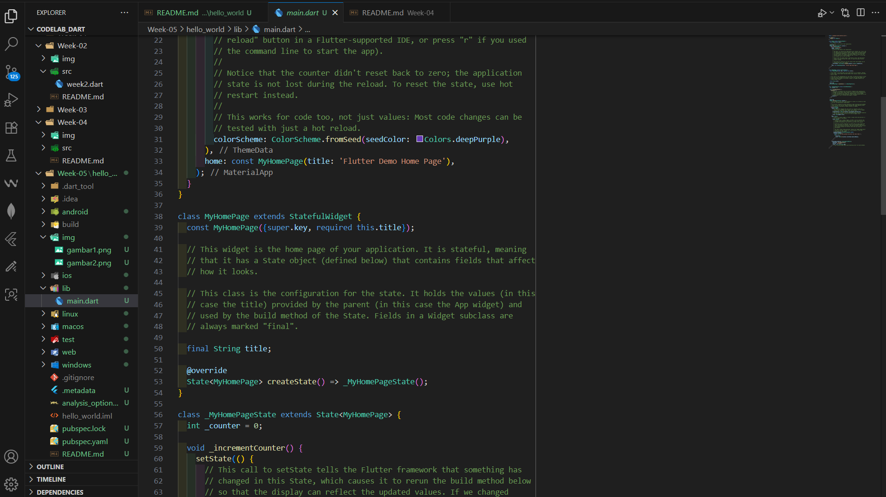
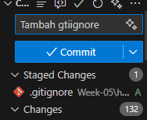
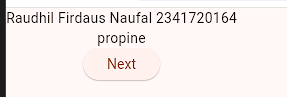
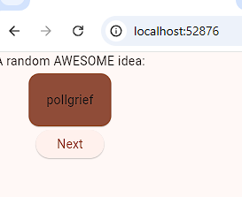

# Aplikasi Pertama dan Widget Dasar Flutter

**Nama : Raudhil Firdaus Naufal** 

**NIM : 2341720164**  

**Kelas : TI-3G**

# Soal 1 Selesaikan Praktikum 1 sampai 5, lalu dokumentasikan dan push ke repository Anda berupa screenshot setiap hasil pekerjaan beserta penjelasannya di file README.md!

# Praktikum 1: Membuat Project Flutter Baru

**Langkah 1:**

**Langkah 2:**

**Langkah 3:**

Membuat project baru dengan cara ctrl + shift + p, lalu membuat file flutter baru sehingga mendapat template dari flutter yang sudah bisa dijalankan

# Praktikum 2: Menghubungkan Perangkat Android atau Emulator

Menghubungkan dengan beberapa cara, salah satunya dengan USB dari laptop ke android

# Praktikum 3: Membuat Repository GitHub dan Laporan Praktikum

**Langkah 1:**

**Langkah 2:**

**Langkah 3:**

**Langkah 4:**

Melakukan push ke repository github yang sudah tersedia lalu menjalankan kode dan membuka tampilan dari flutter yang sudah dibuat

**Langkah 5:**

# Praktikum 4: Menerapkan Widget Dasar

**Langkah 1: Text Widget**

Berhasil  membuat fungsi yang dimana halaman utama bisa mengambil fungsi dari kode di file yang lain dengan melakukan import terlebih dahulu

**Langkah 2: Image Widget**

Berhasil memasukkan gambar ke dalam halaman website dengan cara mengimport widget gambar lalu menambahkan direktori baru di pubspec.yaml untuk gambar

# Praktikum 5: Menerapkan Widget Material Design dan iOS Cupertino

**Langkah 1: Cupertino Button dan Loading Bar**

**Langkah 2: Floating Action Button (FAB)**

**Langkah 3: Scaffold Widget**

**Langkah 4: Dialog Widget**

**Langkah 5: Input dan Selection Widget**

**Langkah 6: Date and Time Pickers**

Pada kode diatas kita membuat beberapa fitur yang bisa dimunculkan di flutter

# Soal 2 Selesaikan Praktikum 2 dan Anda wajib menjalankan aplikasi hello_world pada perangkat fisik (device Android/iOS) agar Anda mempunyai pengalaman untuk menghubungkan ke perangkat fisik. Capture hasil aplikasi di perangkat, lalu buatlah laporan praktikum pada file README.md.

Berhasil menghubungkan antara device laptop dengan android, dengan cara menggunakan kabel USB, lalu run flutter dengan terminal, setelah itu diinstall di android.

# Soal 3 Pada praktikum 5 mulai dari Langkah 3 sampai 6, buatlah file widget tersendiri di folder basic_widgets, kemudian pada file main.dart cukup melakukan import widget sesuai masing-masing langkah tersebut!

Langkah 3:

Mengganti Tampilan

Langkah 4:

Memunculkan Alert

Langkah 5:

Bisa memasukkan input

Langkah 6:

Memilih Tanggal

# Soal 4 Selesaikan Codelabs: Your first Flutter app, lalu buatlah laporan praktikumnya dan push ke repository GitHub Anda!

**Membuat Projek**

Diatas saya mengganti kode-kode sesuai instruksi dari jobsheet

**Menambahkan Tombol**

Menambah teks

Mengganti teks

Menambah tombol

Mengacak Huruf

Output 1

Output 2

Output 3

**Memperindah tampilan aplikasi**

Mengekstrak widget

Menambahkan Kartu

TextTheme

Menempatkan UI di tengah

**Menambahkan fungsi**

Menambahkan logika bisnis

Menambahkan tombol

Menambahkan kolom samping navigasi

Widget stateless versus stateful

setState

Output 1

Output 2

Menggunakan selectedIndex

Output 1

Output 2

Tingkat respons

**Menambahkan halaman baru**

# Soal 5 README.md berisi: capture hasil akhir tiap praktikum (side-by-side, bisa juga berupa file GIF agar terlihat proses perubahan ketika ada aksi dari pengguna) dengan menampilkan NIM dan Nama Anda sebagai ciri pekerjaan Anda.

# Kumpulkan berupa link repository/commit GitHub Anda kepada dosen yang telah disepakati!

