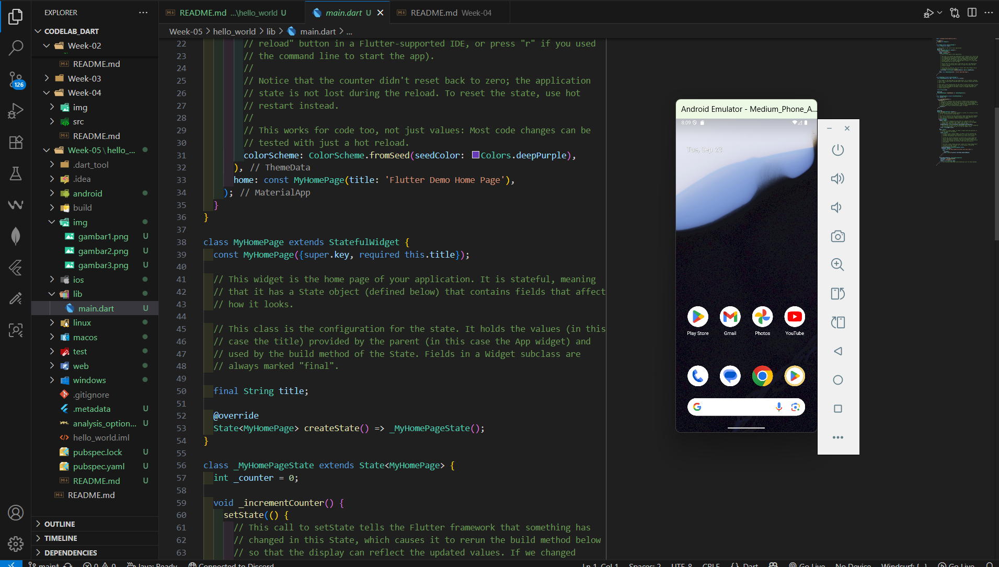

# Aplikasi Pertama dan Widget Dasar Flutter

**Nama : Raudhil Firdaus Naufal** 

**NIM : 2341720164**  

**Kelas : TI-3G**

# Soal 1 Selesaikan Praktikum 1 sampai 5, lalu dokumentasikan dan push ke repository Anda berupa screenshot setiap hasil pekerjaan beserta penjelasannya di file README.md!

# Praktikum 1: Membuat Project Flutter Baru

**Langkah 1:**

**Langkah 2:**

**Langkah 3:**

# Praktikum 2: Menghubungkan Perangkat Android atau Emulator

# Praktikum 3: Membuat Repository GitHub dan Laporan Praktikum

**Langkah 1:**

**Langkah 2:**

**Langkah 3:**

