# Layout dan Navigasi

**Nama : Raudhil Firdaus Naufal** 

**NIM : 2341720164**  

**Kelas : TI-3G**

# Tugas Praktikum 1

# Soal 1: Selesaikan Praktikum 1 sampai 4, lalu dokumentasikan dan push ke repository Anda berupa screenshot setiap hasil pekerjaan beserta penjelasannya di file README.md!

# Praktikum 1: Membangun Layout di Flutter

**Langkah 1 Buat Project Baru**

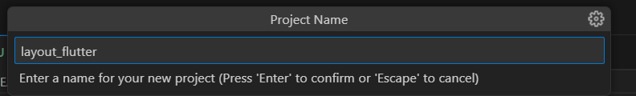

**Langkah 2: Buka file lib/main.dart**

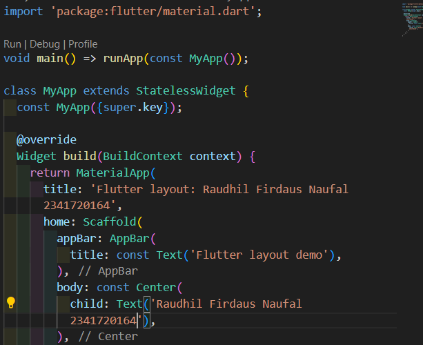

**Langkah 3: Identifikasi layout diagram**

**Langkah 4: Implementasi title row**

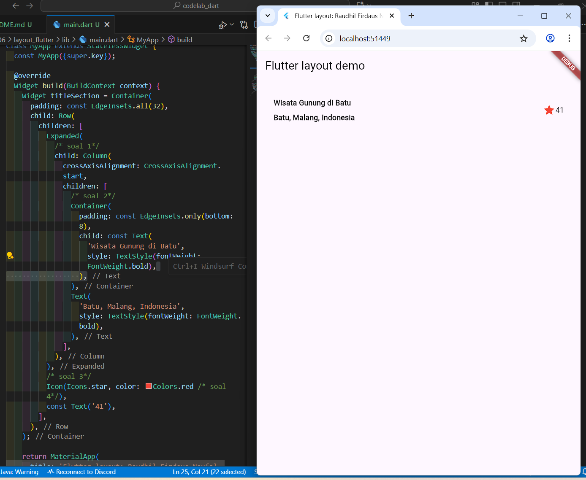

# Praktikum 2: Implementasi button row

**Langkah 1: Buat method Column _buildButtonColumn**

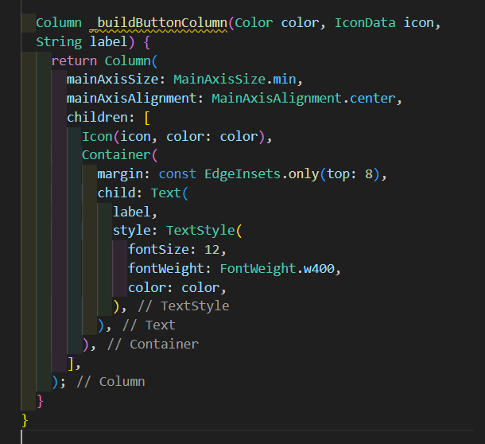

**Langkah 2: Buat widget buttonSection**

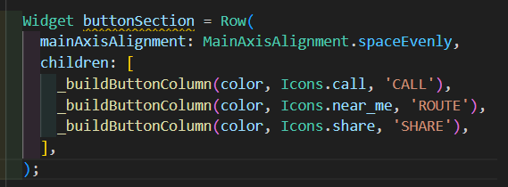

**Langkah 3: Tambah button section ke body**

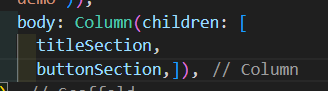

# Praktikum 3: Implementasi text section

**Langkah 1: Buat widget textSection**

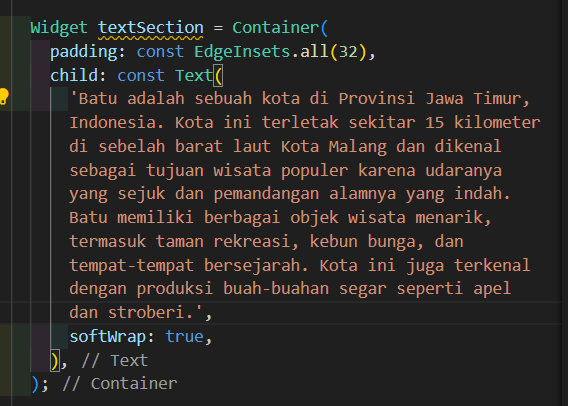

**Langkah 2: Tambahkan variabel text section ke body**

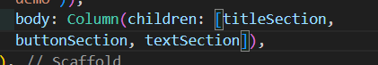

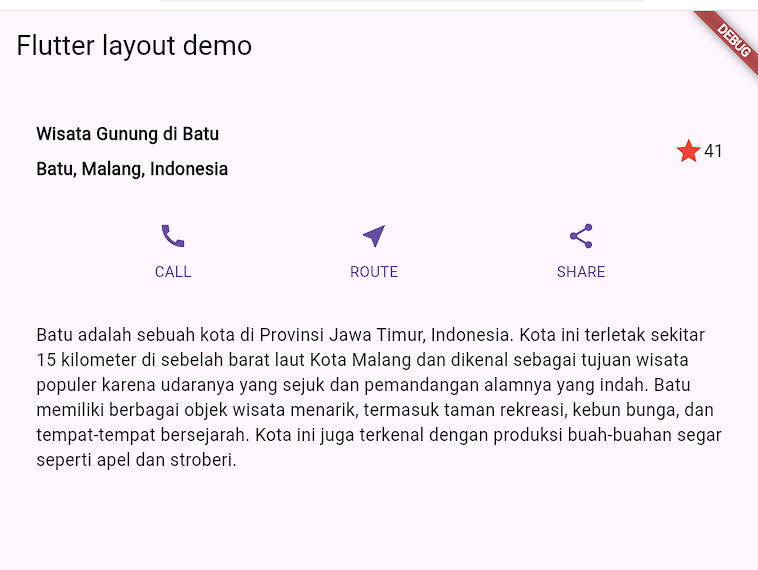

# Praktikum 4: Implementasi image section

**Langkah 1: Siapkan aset gambar**


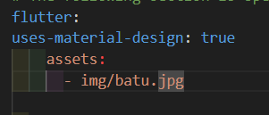

**Langkah 2: Tambahkan gambar ke body**

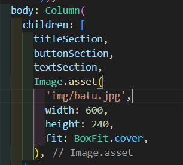

**Langkah 3: Terakhir, ubah menjadi ListView**

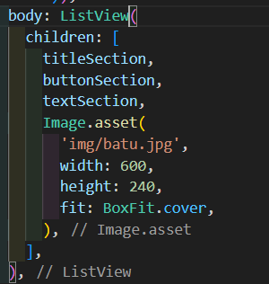

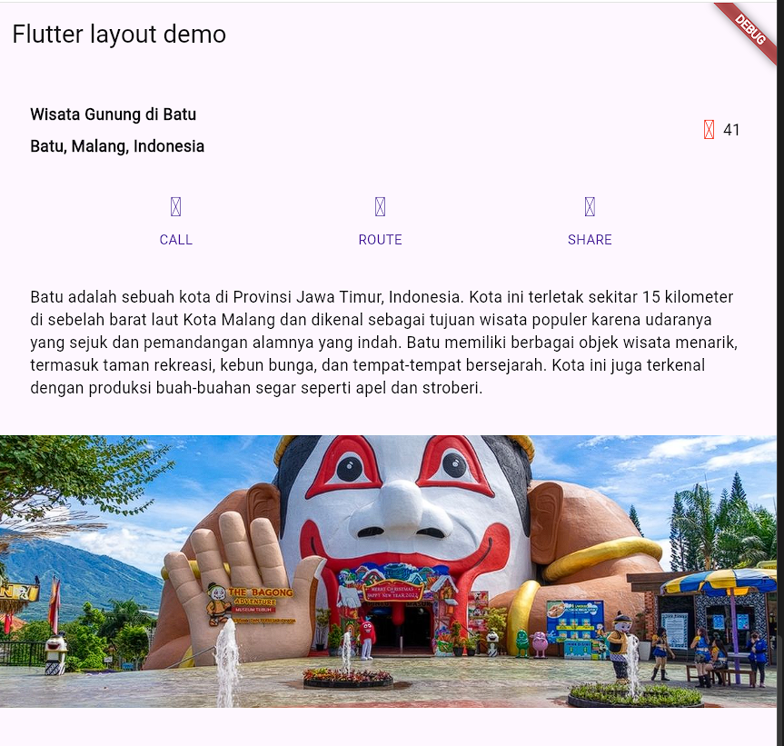

# Soal 2 Silakan implementasikan di project baru "basic_layout_flutter" dengan mengakses sumber ini: https://docs.flutter.dev/codelabs/layout-basics

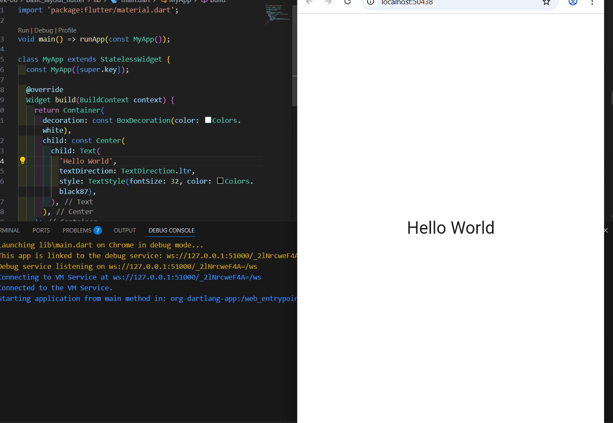

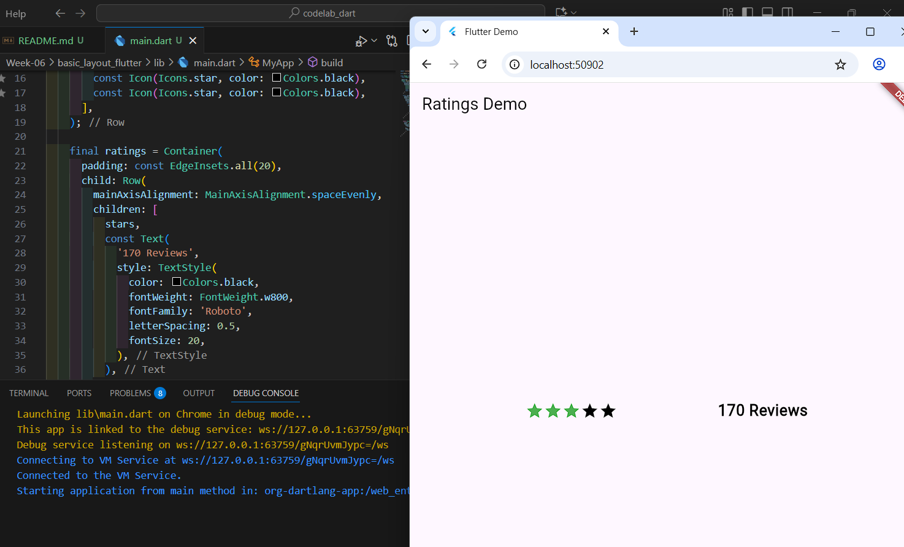

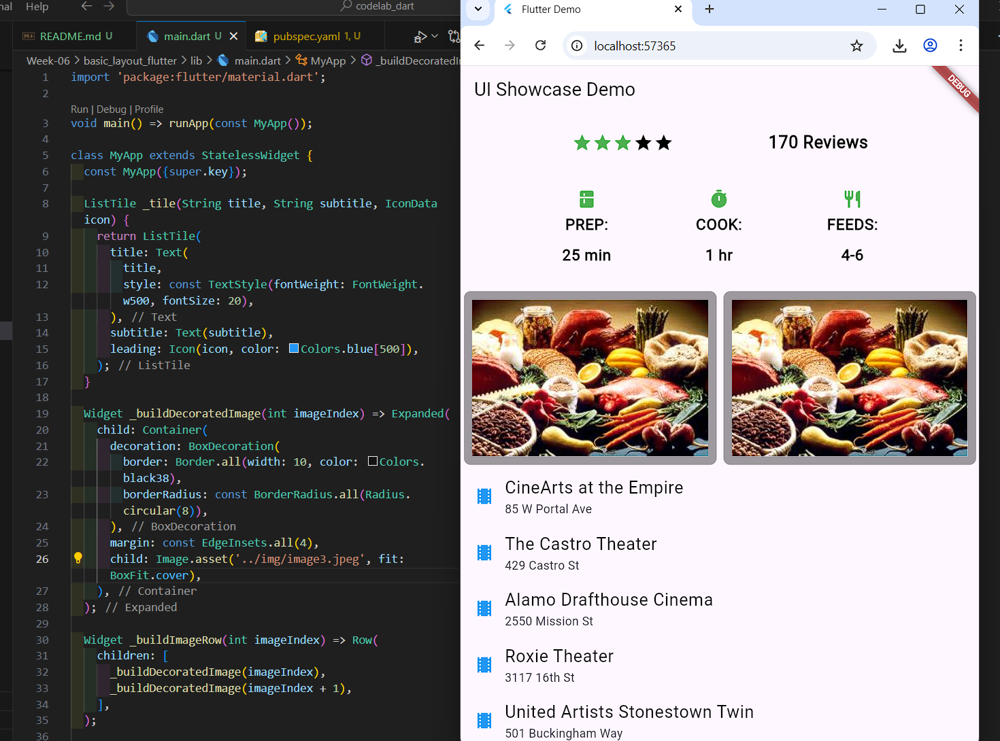

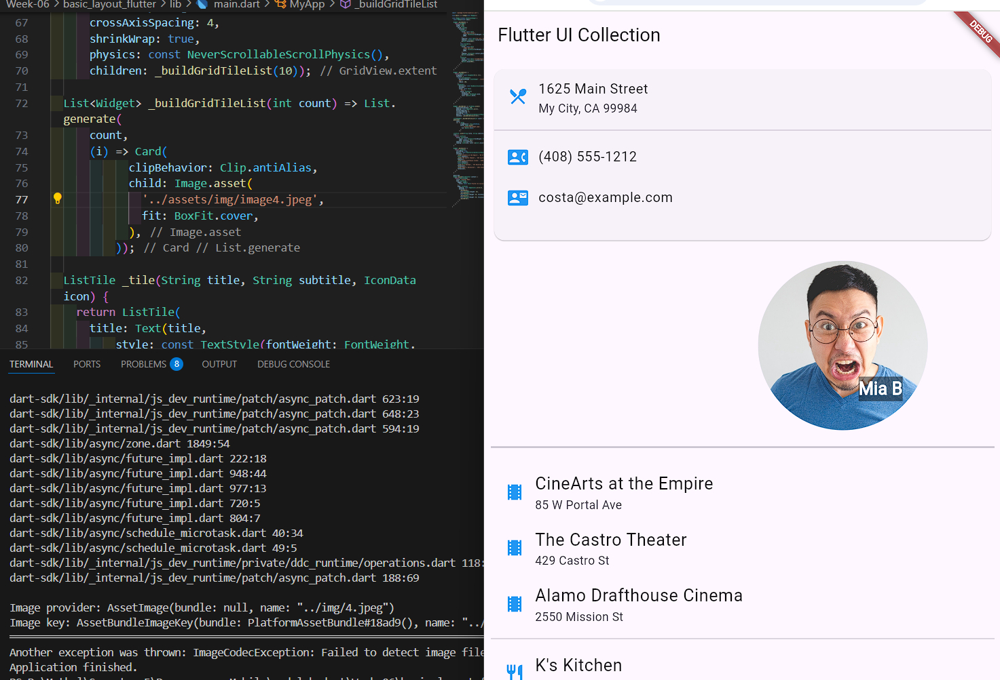

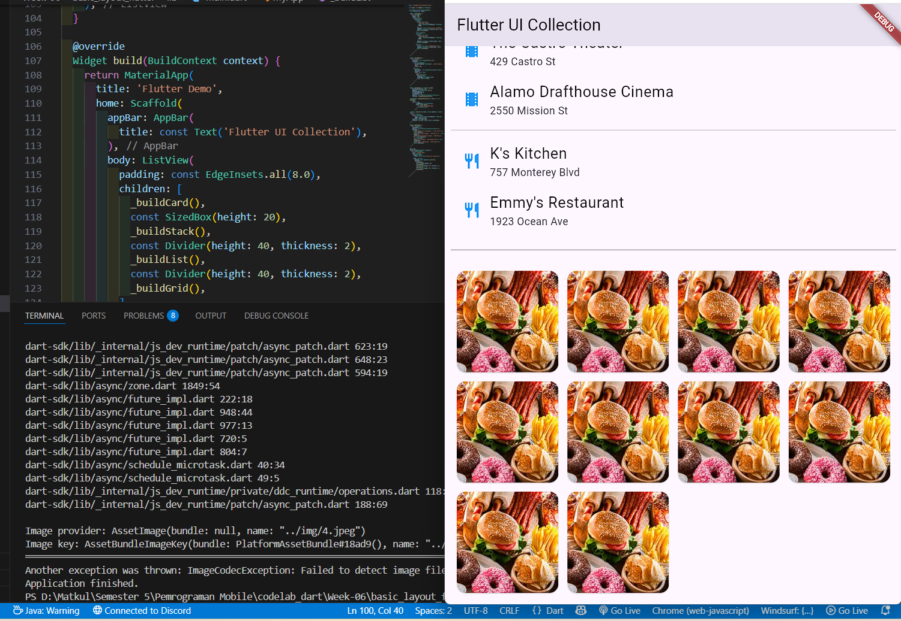

# 3. Kumpulkan link commit repository GitHub Anda kepada dosen yang telah disepakati!

# Tugas Praktikum 2

# Praktikum 5: Membangun Navigasi di Flutter

**Langkah 1: Siapkan project baru**

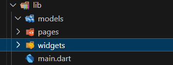

**Langkah 2: Mendefinisikan Route**

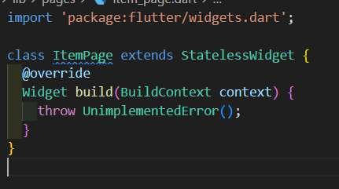

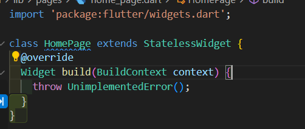

**Langkah 3: Lengkapi Kode di main.dart**

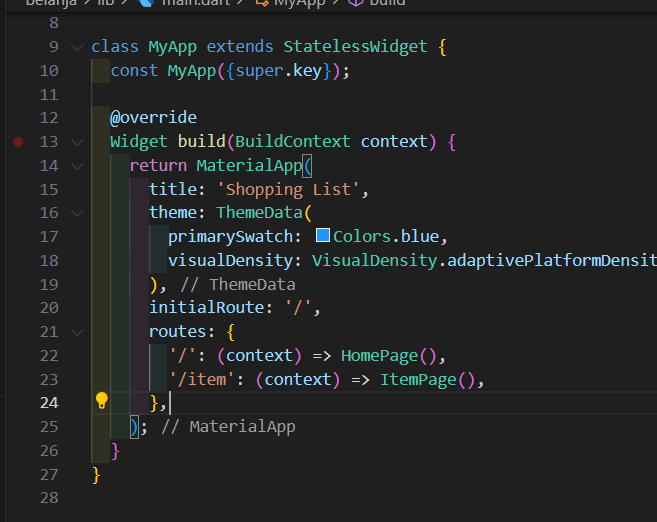

**Langkah 4: Membuat data model**

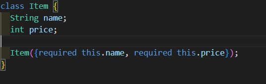

**Langkah 5: Lengkapi kode di class HomePage**

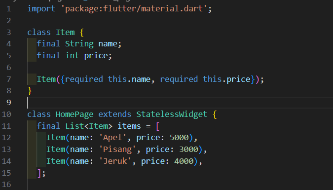

**Langkah 6: Membuat ListView dan itemBuilder**

```dart

HomePage({Key? key}) : super(key: key);

  @override
  Widget build(BuildContext context) {
    return Scaffold(
      appBar: AppBar(title: const Text('Shopping List')),
      body: Container(
        margin: const EdgeInsets.all(8),
        child: ListView.builder(
          padding: const EdgeInsets.all(8),
          itemCount: items.length,
          itemBuilder: (context, index) {
            final item = items[index];
            return InkWell(
              onTap: () {
                Navigator.pushNamed(context, '/item');
              },
              child: Card(
                child: Container(
                  margin: const EdgeInsets.all(8),
                  child: Row(
                    children: [
                      Expanded(child: Text(item.name)),
                      Expanded(
                        child: Text(
                          'Rp ${item.price}',
                          textAlign: TextAlign.end,
                        ),
                      ),
                    ],
                  ),
                ),
              ),
            );
          },
        ),
      ),
    );
  }
}

```

**Langkah 7: Menambahkan aksi pada ListView**


```dart
 return InkWell(
              onTap: () {
                Navigator.pushNamed(context, '/item');
              },
```

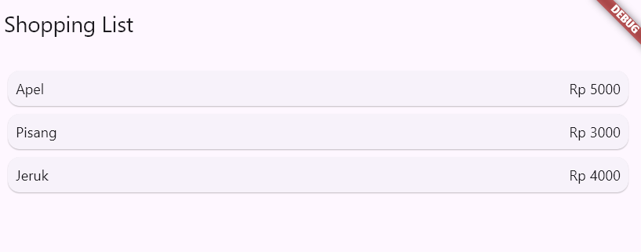

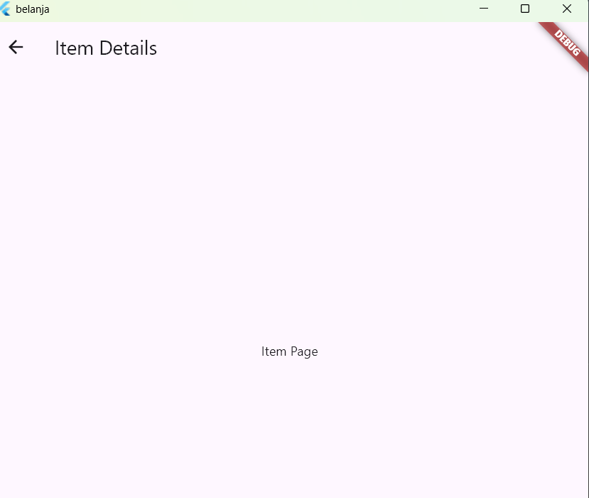

# Tugas Praktikum 2

**1. Untuk melakukan pengiriman data ke halaman berikutnya, cukup menambahkan informasi arguments pada penggunaan Navigator. Perbarui kode pada bagian Navigator menjadi seperti berikut.**

```dart
return InkWell(
              onTap: () {
                Navigator.pushNamed(context, '/item', arguments: item);
              },
```

**2. Pembacaan nilai yang dikirimkan pada halaman sebelumnya dapat dilakukan menggunakan ModalRoute. Tambahkan kode berikut pada blok fungsi build dalam halaman ItemPage. Setelah nilai didapatkan, anda dapat menggunakannya seperti penggunaan variabel pada umumnya.**

```dart
import 'package:flutter/material.dart';
import 'home_page.dart';

class ItemPage extends StatelessWidget {
  const ItemPage({super.key});

  @override
  Widget build(BuildContext context) {
    final itemArgs = ModalRoute.of(context)!.settings.arguments as Item;

    return Scaffold(
      appBar: AppBar(title: const Text('Item Details')),
      body: Center(
        child: Column(
          mainAxisAlignment: MainAxisAlignment.center,
          children: [
            Text(
              'Item Name: ${itemArgs.name}',
              style: const TextStyle(fontSize: 20),
            ),
            const SizedBox(height: 20),
            Text(
              'Price: Rp ${itemArgs.price}',
              style: const TextStyle(fontSize: 20),
            ),
          ],
        ),
      ),
    );
  }
}
```

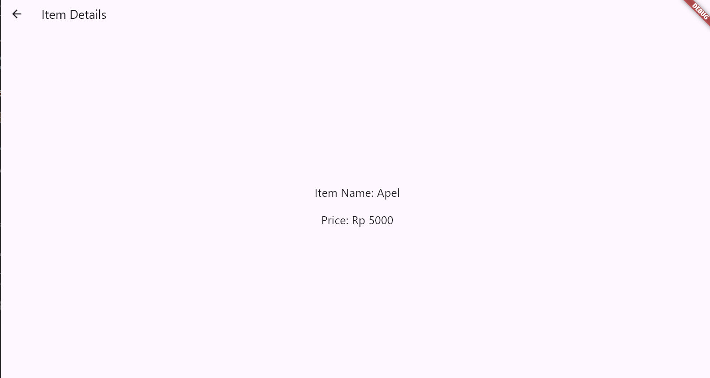

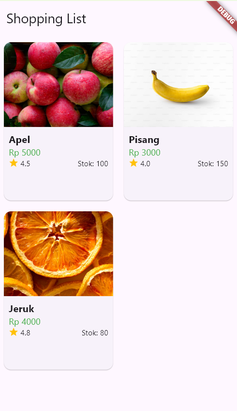

**4. Silakan implementasikan Hero widget pada aplikasi belanja Anda dengan mempelajari dari sumber ini: https://docs.flutter.dev/cookbook/navigation/hero-animations**

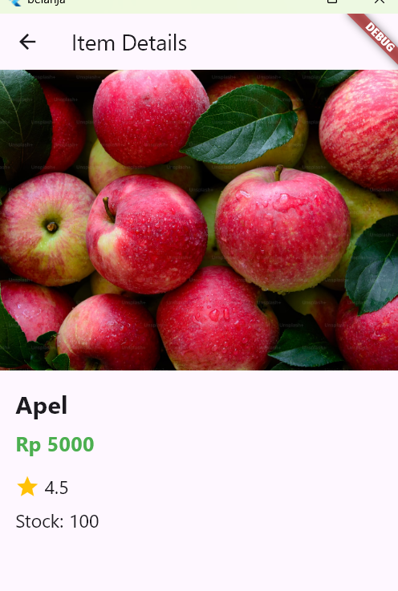

**5. Sesuaikan dan modifikasi tampilan sehingga menjadi aplikasi yang menarik. Selain itu, pecah widget menjadi kode yang lebih kecil. Tambahkan Nama dan NIM di footer aplikasi belanja Anda.**

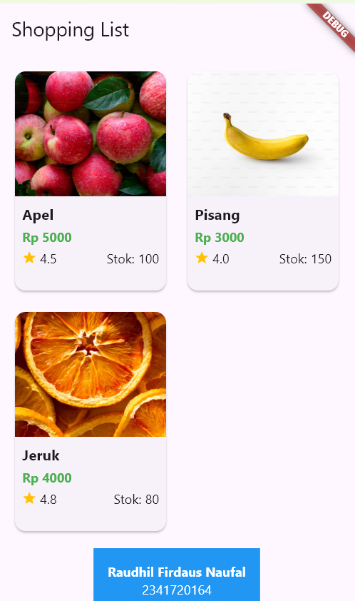


**6. Selesaikan Praktikum 5: Navigasi dan Rute tersebut. Cobalah modifikasi menggunakan plugin go_router, lalu dokumentasikan dan push ke repository Anda berupa screenshot setiap hasil pekerjaan beserta penjelasannya di file README.md. Kumpulkan link commit repository GitHub Anda kepada dosen yang telah disepakati!**

Hasil Akhir

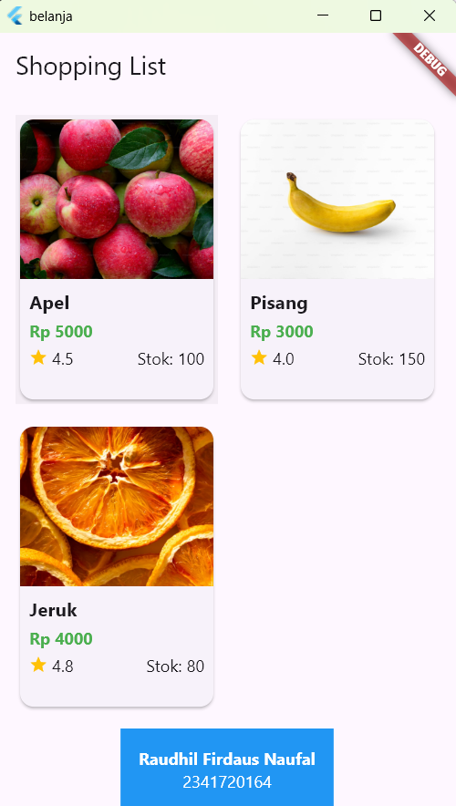

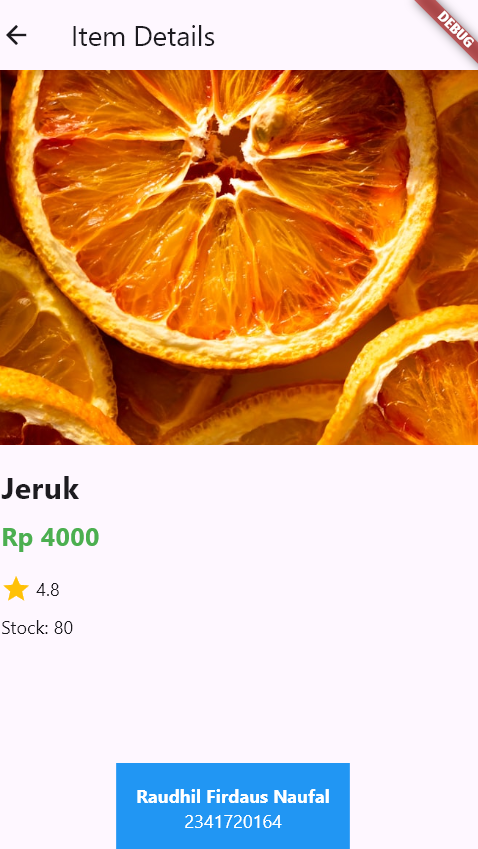

