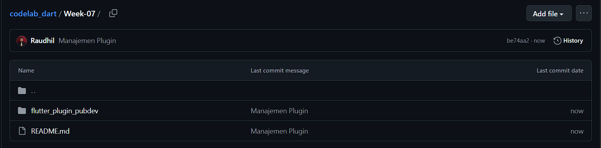
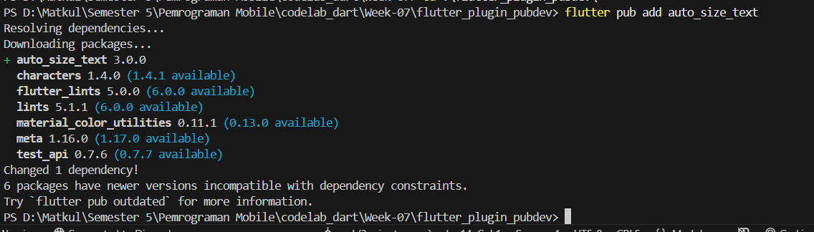
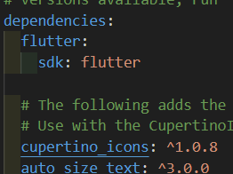
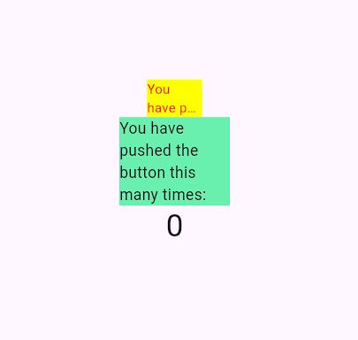

# Manajemen Plugin

**Nama : Raudhil Firdaus Naufal** 

**NIM : 2341720164**  

**Kelas : TI-3G**

# Praktikum Menerapkan Plugin di Project Flutter

# Tugas Praktikum 

**1. Selesaikan Praktikum tersebut, lalu dokumentasikan dan push ke repository Anda berupa screenshot hasil pekerjaan beserta penjelasannya di file README.md!**

**Langkah 1: Buat Project Baru**



**Langkah 2: Menambahkan Plugin**





**Langkah 3: Buat file red_text_widget.dart**

```dart
import 'package:flutter/material.dart';

class RedTextWidget extends StatelessWidget {
  const RedTextWidget({Key? key}) : super(key: key);

  @override
  Widget build(BuildContext context) {
    return Container();
  }
}
```

**Langkah 4: Tambah Widget AutoSizeText**

```dart
import 'package:flutter/material.dart';
import 'package:auto_size_text/auto_size_text.dart';

class RedTextWidget extends StatelessWidget {
  final String text;

  const RedTextWidget({Key? key, required this.text}) : super(key: key);

  @override
  Widget build(BuildContext context) {
    return AutoSizeText(
      text,
      style: const TextStyle(color: Colors.red, fontSize: 14),
      maxLines: 2,
      overflow: TextOverflow.ellipsis,
    );
  }
}
```


**Langkah 5: Buat Variabel text dan parameter di constructor**

```dart
import 'package:flutter/material.dart';
import 'package:auto_size_text/auto_size_text.dart';

class RedTextWidget extends StatelessWidget {
  final String text;

  const RedTextWidget({Key? key, required this.text})
    : super(key: key); 

  @override
  Widget build(BuildContext context) {
    return AutoSizeText(
      text,
      style: const TextStyle(color: Colors.red, fontSize: 14),
      maxLines: 2,
      overflow: TextOverflow.ellipsis,
    );
  }
}
```


**Langkah 6: Tambahkan widget di main.dart**

```dart
import 'package:flutter/material.dart';

void main() {
  runApp(const MyApp());
}

class MyApp extends StatelessWidget {
  const MyApp({super.key});

  // This widget is the root of your application.
  @override
  Widget build(BuildContext context) {
    return MaterialApp(
      title: 'Flutter Demo',
      theme: ThemeData(
        // This is the theme of your application.
        //
        // TRY THIS: Try running your application with "flutter run". You'll see
        // the application has a purple toolbar. Then, without quitting the app,
        // try changing the seedColor in the colorScheme below to Colors.green
        // and then invoke "hot reload" (save your changes or press the "hot
        // reload" button in a Flutter-supported IDE, or press "r" if you used
        // the command line to start the app).
        //
        // Notice that the counter didn't reset back to zero; the application
        // state is not lost during the reload. To reset the state, use hot
        // restart instead.
        //
        // This works for code too, not just values: Most code changes can be
        // tested with just a hot reload.
        colorScheme: ColorScheme.fromSeed(seedColor: Colors.deepPurple),
      ),
      home: const MyHomePage(title: 'Flutter Demo Home Page'),
    );
  }
}

class MyHomePage extends StatefulWidget {
  const MyHomePage({super.key, required this.title});

  // This widget is the home page of your application. It is stateful, meaning
  // that it has a State object (defined below) that contains fields that affect
  // how it looks.

  // This class is the configuration for the state. It holds the values (in this
  // case the title) provided by the parent (in this case the App widget) and
  // used by the build method of the State. Fields in a Widget subclass are
  // always marked "final".

  final String title;

  @override
  State<MyHomePage> createState() => _MyHomePageState();
}

class _MyHomePageState extends State<MyHomePage> {
  int _counter = 0;

  void _incrementCounter() {
    setState(() {
      // This call to setState tells the Flutter framework that something has
      // changed in this State, which causes it to rerun the build method below
      // so that the display can reflect the updated values. If we changed
      // _counter without calling setState(), then the build method would not be
      // called again, and so nothing would appear to happen.
      _counter++;
    });
  }

  @override
  Widget build(BuildContext context) {
    return Scaffold(
      appBar: AppBar(
        backgroundColor: Theme.of(context).colorScheme.inversePrimary,
        title: Text(widget.title),
      ),
      body: Center(
        child: Column(
          mainAxisAlignment: MainAxisAlignment.center,
          children: <Widget>[
            Container(
              color: Colors.yellowAccent,
              width: 50,
              child: const RedTextWidget(
                text: 'You have pushed the button this many times:',
              ),
            ),
            Container(
              color: Colors.greenAccent,
              width: 100,
              child: const Text('You have pushed the button this many times:'),
            ),
            Text(
              '$_counter',
              style: Theme.of(context).textTheme.headlineMedium,
            ),
          ],
        ),
      ),
      floatingActionButton: FloatingActionButton(
        onPressed: _incrementCounter,
        tooltip: 'Increment',
        child: const Icon(Icons.add),
      ), // This trailing comma makes auto-formatting nicer for build methods.
    );
  }
}

class RedTextWidget extends StatelessWidget {
  const RedTextWidget({super.key, required this.text});

  final String text;

  @override
  Widget build(BuildContext context) {
    return Text(text, style: const TextStyle(color: Colors.red));
  }
}
```



**2. Jelaskan maksud dari langkah 2 pada praktikum tersebut!**

Maksud dari langkah 2 pada praktikum tersebut adalah untuk menambahkan plugin auto size text pada flutter, jadi ketika halaman kita pada ukuran tertentu maka akan menyesuaikan objek didalamnya

**3. Jelaskan maksud dari langkah 5 pada praktikum tersebut!**

Maksud dari langkah 5 pada praktikum tersebut adalah membuat sebuah widget yang memiliki parameter wajib berupa text, dan parameter text akan disimpan dan tidak bisa diubah lagi.

**4. Pada langkah 6 terdapat dua widget yang ditambahkan, jelaskan fungsi dan perbedaannya!**

Pada langkah ke 6 ada 2 widget yang ditambahkan,

Fungsi: Widget yang pertama menggunakan RedTextWidget yang memiliki fitur auto-size, sehingga akan menyesuaikan otomatis text sesuai dengan layar, sedangkan widget yang kedua adalah text biasa dengan lebar 100px, yang akan menampilkan semua.

Perbedaan: Perbedaan antara widget pertama dan kedua adalah, widget pertama menggunakan plugin sementara widget kedua tidak.

**5. Jelaskan maksud dari tiap parameter yang ada di dalam plugin auto_size_text berdasarkan tautan pada dokumentasi ini !**

key: Kunci unik untuk widget, mengontrol bagaimana ia diperbarui dalam struktur tree.

textKey: Kunci unik khusus untuk widget Text internal.

style: Mengatur gaya visual teks (warna, ukuran, ketebalan font).

minFontSize: Ukuran font minimum saat ukuran teks disesuaikan otomatis.

maxFontSize: Ukuran font maksimum saat ukuran teks disesuaikan otomatis.

stepGranularity: Interval/langkah penurunan ukuran font saat penyesuaian otomatis.

presetFontSizes: Daftar ukuran font yang sudah ditentukan untuk dipilih secara otomatis.

group: Menyamakan ukuran font beberapa widget AutoSizeText dalam satu grup.

textAlign: Perataan teks secara horizontal (kiri, tengah, kanan).

textDirection: Arah alur teks (misalnya, dari kiri ke kanan / ltr).

locale: Memilih font yang sesuai berdasarkan bahasa atau wilayah.

softWrap: Mengatur apakah teks akan otomatis pindah ke baris baru atau tidak.

wrapWords: Membungkus kata yang terlalu panjang ke baris berikutnya.

overflow: Cara menangani teks yang melebihi batas (misalnya dipotong, diberi elipsis '...').

overflowReplacement: Widget pengganti yang muncul saat teks mengalami overflow.

textScaleFactor: Faktor pengali ukuran font, biasanya untuk aksesibilitas.

maxLines: Batas jumlah baris maksimum untuk teks.

semanticsLabel: Label teks alternatif untuk fitur aksesibilitas (seperti screen reader).

**6. Kumpulkan laporan praktikum Anda berupa link repository GitHub kepada dosen!**