# Kamera

**Nama : Raudhil Firdaus Naufal** 

**NIM : 2341720164**  

**Kelas : TI-3G**

# Tugas Praktikum

**1. Selesaikan Praktikum 1 dan 2, lalu dokumentasikan dan push ke repository Anda berupa screenshot setiap hasil pekerjaan beserta penjelasannya di file README.md! Jika terdapat error atau kode yang tidak dapat berjalan, silakan Anda perbaiki sesuai tujuan aplikasi dibuat!**

# Praktikum 1: Mengambil Foto dengan Kamera di Flutter

**Langkah 1: Buat Project Baru**

Buatlah sebuah project flutter baru dengan nama kamera_flutter, lalu sesuaikan style laporan praktikum yang Anda buat.

**Langkah 2: Tambah dependensi yang diperlukan**

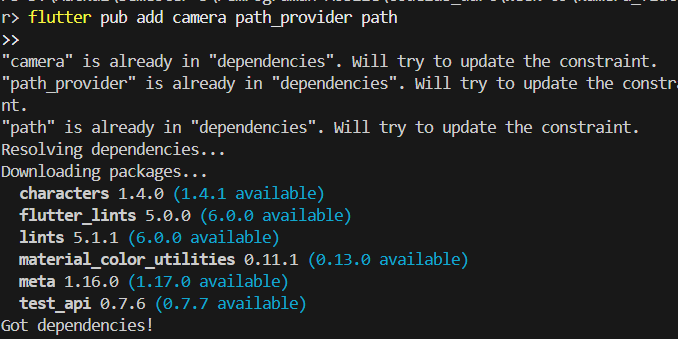

**Langkah 3: Ambil Sensor Kamera dari device**

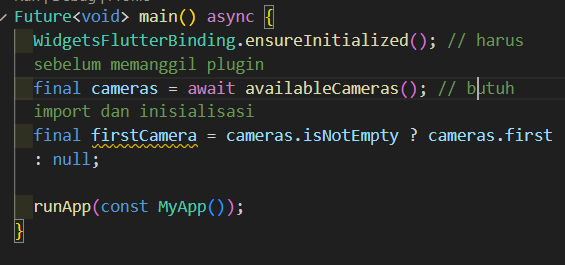

**Langkah 4: Buat dan inisialisasi CameraController**

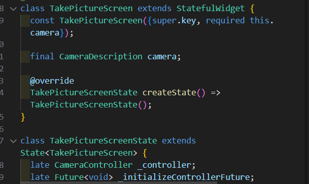

**Langkah 5: Gunakan CameraPreview untuk menampilkan preview foto**

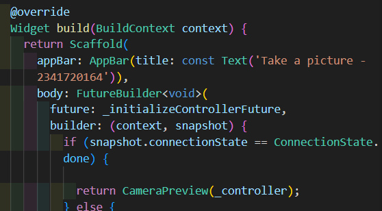

**Langkah 6: Ambil foto dengan CameraController**

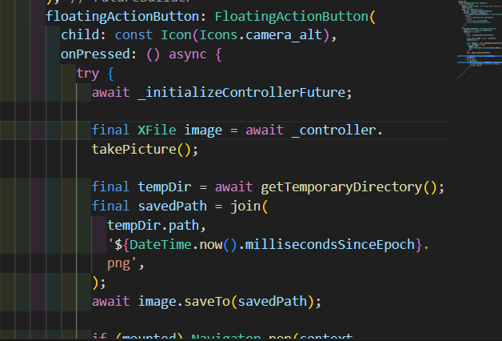

**Langkah 7: Buat widget baru DisplayPictureScreen**

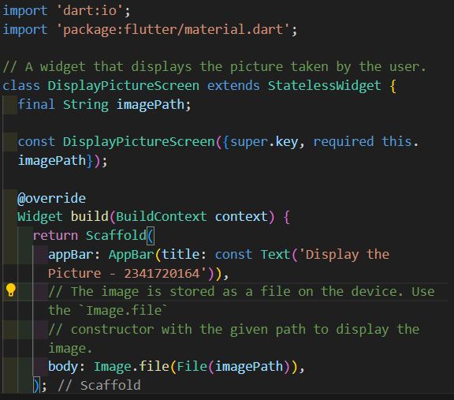

**Langkah 8: Edit main.dart**

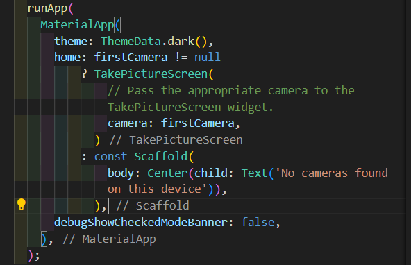

**Langkah 9: Menampilkan hasil foto**

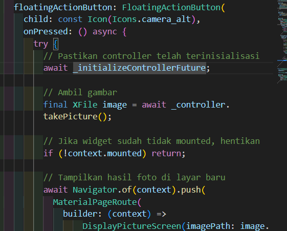

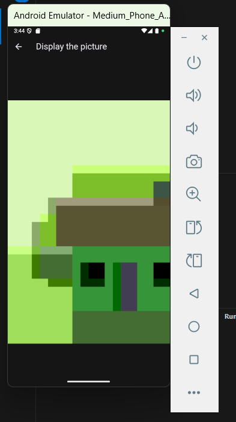

# Praktikum 2: Membuat photo filter carousel

**Langkah 1: Buat project baru**

Buatlah project flutter baru di pertemuan 09 dengan nama photo_filter_carousel

**Langkah 2: Buat widget Selector ring dan dark gradient**

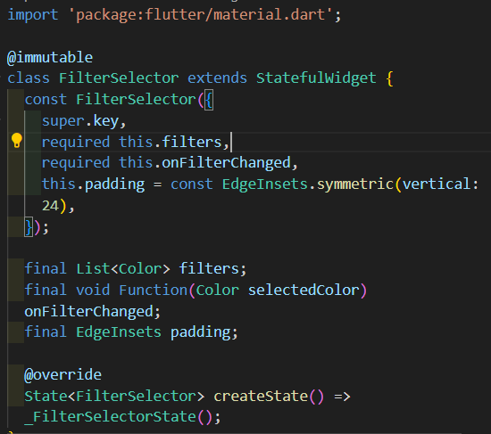

**Langkah 3: Buat widget photo filter carousel**    

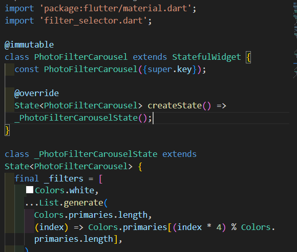

**Langkah 4: Membuat filter warna - bagian 1**

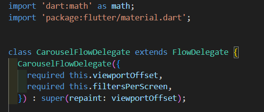

**Langkah 5: Membuat filter warna**

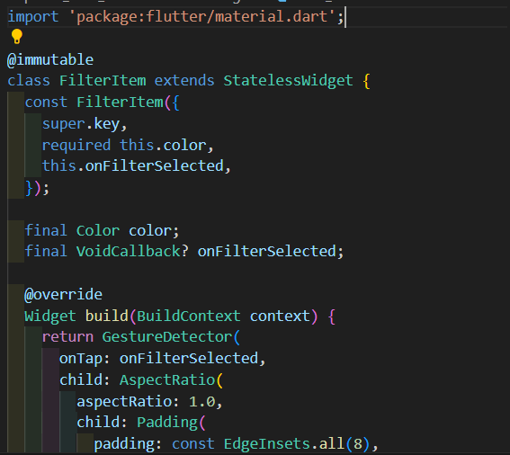

**Langkah 6: Implementasi filter carousel**

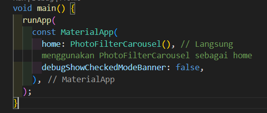

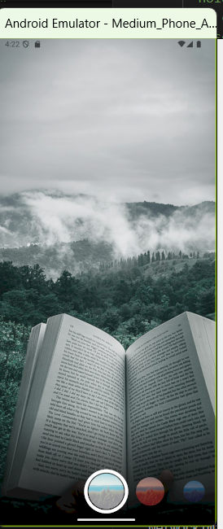

**2. Gabungkan hasil praktikum 1 dengan hasil praktikum 2 sehingga setelah melakukan pengambilan foto, dapat dibuat filter carouselnya!**

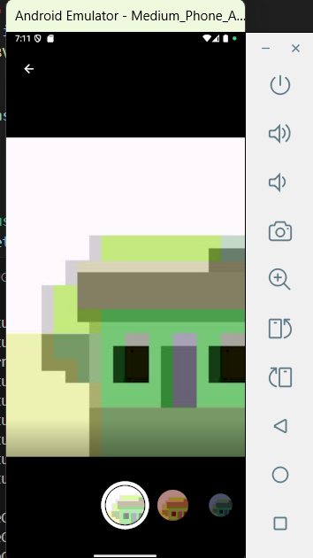

**3. Jelaskan maksud void async pada praktikum 1?**

Async adalah tanda khusus yang kita berikan pada sebuah fungsi, yang memiliki tugas yang membutuhkan waktu lama contohnya menyalakan kamera.

**4. Jelaskan fungsi dari anotasi @immutable dan @override ?**

- @immutable: Memberitahu developer lain kalau field dalam class ini tidak akan pernah berubah setelah object dibuat, yang membuatnya aman untuk digunakan.

- @override: Wajib digunakan untuk menandai kalau suatu metode atau fungsi dalam subclass sedang menimpa atauu mengganti implementasi dari metode yang sudah ada di parent classnya
