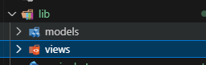
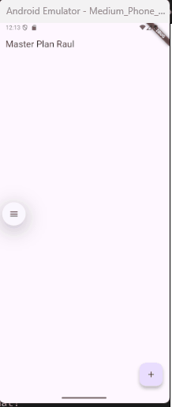
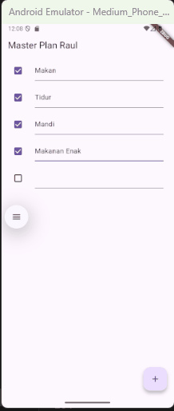

# Kamera

**Nama : Raudhil Firdaus Naufal** 

**NIM : 2341720164**  

**Kelas : TI-3G**

# Tugas Praktikum 1

# 1. Selesaikan langkah-langkah praktikum tersebut, lalu dokumentasikan berupa GIF hasil akhir praktikum beserta penjelasannya di file README.md! Jika Anda menemukan ada yang error atau tidak berjalan dengan baik, silakan diperbaiki.

# Praktikum 1

**Langkah 1: Buat Project Baru**

**Langkah 2: Membuat model task.dart**

**Langkah 3: Buat file plan.dart**

**Langkah 4: Buat file data_layer.dart**

**Langkah 5: Pindah ke file main.dart**

**Langkah 6: buat plan_screen.dart**

**Langkah 7: buat method _buildAddTaskButton()**

**Langkah 8: buat widget _buildList()**

**Langkah 9: buat widget _buildTaskTile**

**Langkah 10: Tambah Scroll Controller**

**Langkah 11: Tambah Scroll Listener**

**Langkah 12: Tambah controller dan keyboard behavior**

**Langkah 13: Terakhir, tambah method dispose()**

**Langkah 14: Hasil**

Disini kita membuat to do list sederhana, yang disebut sebagai master plan, disini kita bisa menambah task dan memberikan nama pada tugas tersebut, kita juga bisa memberikan centang pada setiap task yang ada.

# 2. Jelaskan maksud dari langkah 4 pada praktikum tersebut! Mengapa dilakukan demikian?

Maksud dari langkah ke 4 pada praktikum tersebut adalah untuk memudahkan proses import file di proyek, agar tidak ribet setiap kali membutuhkan akses ke model Plan dan Task.

# 3. Mengapa perlu variabel plan di langkah 6 pada praktikum tersebut? Mengapa dibuat konstanta ?

Variabel plan dipakai untuk menyimpan data utama yang ditampilkan di layar. Plan di sini adalah model yang berisi daftar task dan juga nama task tersebut.

# 4. Lakukan capture hasil dari Langkah 9 berupa GIF, kemudian jelaskan apa yang telah Anda buat!

Yang sudah saya buat adalah komponen to do list yang interaktif, yang bisa dicentang dan diedit teksnya, dan setiap interaksi otomatis memperbarui data utama serta menyegarkan tampilan di layar.

# 5. Apa kegunaan method pada Langkah 11 dan 13 dalam lifecyle state ?

Untuk menyalakan atau inisialisasi resource saat widget pertama kali muncul, dan mematikan serta membersihkan resource saat widget udah tidak dipakai.

# 6. Kumpulkan laporan praktikum Anda berupa link commit atau repository GitHub ke dosen yang telah disepakati !

