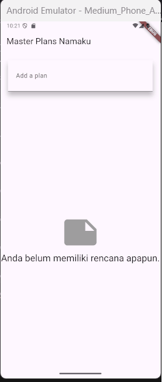

# Kamera

**Nama : Raudhil Firdaus Naufal** 

**NIM : 2341720164**  

**Kelas : TI-3G**

# Tugas Praktikum 1: Dasar State dengan Model-View

# 1. Selesaikan langkah-langkah praktikum tersebut, lalu dokumentasikan berupa GIF hasil akhir praktikum beserta penjelasannya di file README.md! Jika Anda menemukan ada yang error atau tidak berjalan dengan baik, silakan diperbaiki.

# Praktikum 1

**Langkah 1: Buat Project Baru**

**Langkah 2: Membuat model task.dart**

**Langkah 3: Buat file plan.dart**

**Langkah 4: Buat file data_layer.dart**

**Langkah 5: Pindah ke file main.dart**

**Langkah 6: buat plan_screen.dart**

**Langkah 7: buat method _buildAddTaskButton()**

**Langkah 8: buat widget _buildList()**

**Langkah 9: buat widget _buildTaskTile**

**Langkah 10: Tambah Scroll Controller**

**Langkah 11: Tambah Scroll Listener**

**Langkah 12: Tambah controller dan keyboard behavior**

**Langkah 13: Terakhir, tambah method dispose()**

**Langkah 14: Hasil**

Disini kita membuat to do list sederhana, yang disebut sebagai master plan, disini kita bisa menambah task dan memberikan nama pada tugas tersebut, kita juga bisa memberikan centang pada setiap task yang ada.

# 2. Jelaskan maksud dari langkah 4 pada praktikum tersebut! Mengapa dilakukan demikian?

Maksud dari langkah ke 4 pada praktikum tersebut adalah untuk memudahkan proses import file di proyek, agar tidak ribet setiap kali membutuhkan akses ke model Plan dan Task.

# 3. Mengapa perlu variabel plan di langkah 6 pada praktikum tersebut? Mengapa dibuat konstanta ?

Variabel plan dipakai untuk menyimpan data utama yang ditampilkan di layar. Plan di sini adalah model yang berisi daftar task dan juga nama task tersebut.

# 4. Lakukan capture hasil dari Langkah 9 berupa GIF, kemudian jelaskan apa yang telah Anda buat!

Yang sudah saya buat adalah komponen to do list yang interaktif, yang bisa dicentang dan diedit teksnya, dan setiap interaksi otomatis memperbarui data utama serta menyegarkan tampilan di layar.

# 5. Apa kegunaan method pada Langkah 11 dan 13 dalam lifecyle state ?

Untuk menyalakan atau inisialisasi resource saat widget pertama kali muncul, dan mematikan serta membersihkan resource saat widget udah tidak dipakai.

# 6. Kumpulkan laporan praktikum Anda berupa link commit atau repository GitHub ke dosen yang telah disepakati !

# Tugas Praktikum 2: InheritedWidget

# 1. Selesaikan langkah-langkah praktikum tersebut, lalu dokumentasikan berupa GIF hasil akhir praktikum beserta penjelasannya di file README.md! Jika Anda menemukan ada yang error atau tidak berjalan dengan baik, silakan diperbaiki sesuai dengan tujuan aplikasi tersebut dibuat.

# Praktikum 2: Mengelola Data Layer dengan InheritedWidget dan InheritedNotifier

**Langkah 1: Buat file plan_provider.dart**

**Langkah 2: Edit main.dart**

**Langkah 3: Tambah method pada model plan.dart**

**Langkah 4: Pindah ke PlanScreen**

**Langkah 5: Edit method _buildAddTaskButton**

**Langkah 6: Edit method _buildTaskTile**

**Langkah 7: Edit _buildList**

**Langkah 8: Tetap di class PlanScreen**

**Langkah 9: Tambah widget SafeArea**

Tujuan dari kode kode diatas adalah agar tampilan daftar tugas bisa otomatis update dari data provider, tampil rapi dengan list dan progress di bawah, serta aman di semua ukuran layar.

# 2. Jelaskan mana yang dimaksud InheritedWidget pada langkah 1 tersebut! Mengapa yang digunakan InheritedNotifier?

InheritedWidget dipakai untuk menyebarkan data ke widget turunan tanpa harus terus di pass manual, sedangkan InheritedNotifier digunakan karena datanya (Plan) bisa berubah,  jadi tiap kali ValueNotifier berubah, widget-widget yang pakai data itu otomatis rebuild.

# 3. Jelaskan maksud dari method di langkah 3 pada praktikum tersebut! Mengapa dilakukan demikian?

Method itu untung menghitung berapa tugas yang sudah selesai dan menampilkan pesan progresnya, agar progres plan bisa ditampilkan otomatis di UI tanpa menghitung manual di setiap tempat.

# 4. Lakukan capture hasil dari Langkah 9 berupa GIF, kemudian jelaskan apa yang telah Anda buat!

Yang telah saya buat adalah, saya membuat tampilan pesan progres tugas agar user bisa melihat berapa tugas yang sudah selesai dari total banyak tugas.

# 5. Kumpulkan laporan praktikum Anda berupa link commit atau repository GitHub ke dosen yang telah disepakati !

#  Tugas Praktikum 3: State di Multiple Screens

# 1. Selesaikan langkah-langkah praktikum tersebut, lalu dokumentasikan berupa GIF hasil akhir praktikum beserta penjelasannya di file README.md! Jika Anda menemukan ada yang error atau tidak berjalan dengan baik, silakan diperbaiki sesuai dengan tujuan aplikasi tersebut dibuat.

# Praktikum 3: Membuat State di Multiple Screens

**Langkah 1: Edit PlanProvider**

**Langkah 2: Edit main.dart**

**Langkah 3: Edit plan_screen.dart**

**Langkah 4: Error**

Itu akan terjadi error setiap kali memanggil PlanProvider.of(context). Itu terjadi karena screen saat ini hanya menerima tugas-tugas untuk satu kelompok Plan, tapi sekarang PlanProvider menjadi list dari objek plan tersebut.

**Langkah 5: Tambah getter Plan**

**Langkah 6: Method initState()**

**Langkah 7: Widget build**

**Langkah 8: Edit _buildTaskTile**

**Langkah 9: Buat screen baru**

**Langkah 10: Pindah ke class _PlanCreatorScreenState**

**Langkah 11: Pindah ke method build**

**Langkah 12: Buat widget _buildListCreator**

**Langkah 13: Buat void addPlan()**

**Langkah 14: Buat widget _buildMasterPlans()**

Setelah mengerjakan praktikum 3, saya berhasil membuat plan creator screen, jadi disitu kita bisa melihat semua plan screen yang ada.

# 2. Berdasarkan Praktikum 3 yang telah Anda lakukan, jelaskan maksud dari gambar diagram berikut ini!

Maksud dari diagram tersebut adalah, diagram tersebut menunjukkan alur navigasi flutter di mana pengguna berpindah dari halaman daftar rencana ke halaman detail rencana menggunakan Navigator.push(), yang intinya adalah, PlanCreatorScreen adalah halaman yang menunjukkan list-list tugas, dan PlanScreen adalah daftar-daftar tugas di dalam setiap list tugas pada PlanCreatorScreen.

# 3. Lakukan capture hasil dari Langkah 14 berupa GIF, kemudian jelaskan apa yang telah Anda buat!

Fungsi kode pada langkah 14 adalah, kita membuat kode untuk menampilkan semua list tugas yang kita buat, dan jika kosong maka akan menampilkan list kosong, dan jika ada listnya bisa kita pencet dan diarahkan ke detail list tersebut.

# 4. Kumpulkan laporan praktikum Anda berupa link commit atau repository GitHub ke dosen yang telah disepakati !

