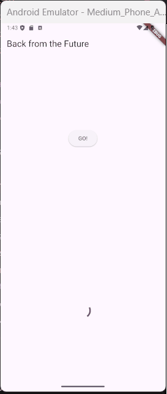
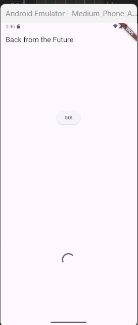
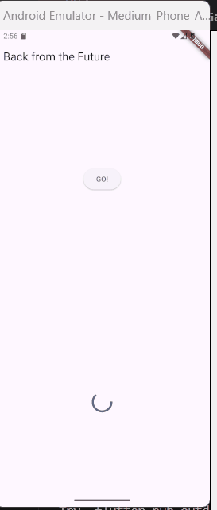
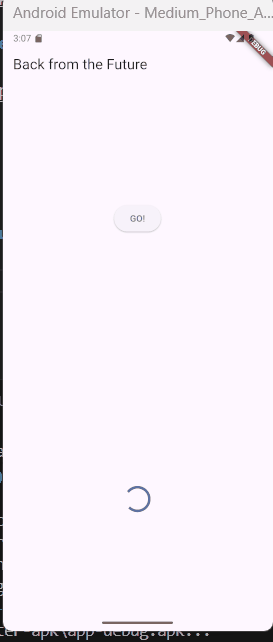

# Pemrograman Asynchronous

**Nama : Raudhil Firdaus Naufal** 

**NIM : 2341720164**  

**Kelas : TI-3G**

# Praktikum 1: Mengunduh Data dari Web Service (API)

**Langkah 1: Buat Project Baru**

**Langkah 2: Cek file pubspec.yaml**

**Langkah 3: Buka file main.dart**

**Soal 1 Tambahkan nama panggilan Anda pada title app sebagai identitas hasil pekerjaan Anda.**

**Langkah 4: Tambah method getData()**

**Soal 2**

**- Carilah judul buku favorit Anda di Google Books, lalu ganti ID buku pada variabel path di kode tersebut. Caranya ambil di URL browser Anda seperti gambar berikut ini.**

**- Kemudian cobalah akses di browser URI tersebut dengan lengkap seperti ini. Jika menampilkan data JSON, maka Anda telah berhasil. Lakukan capture milik Anda dan tulis di README pada laporan praktikum. Lalu lakukan commit dengan pesan "W11: Soal 2".**

**Langkah 5: Tambah kode di ElevatedButton**

**Soal 3**

**Jelaskan maksud kode langkah 5 tersebut terkait substring dan catchError!**

Kode tersebut mengambil data secara asinkron, jika berhasil, ia mengambil 450 karakter pertama dari respons dan memperbarui UI, tetapi jika terjadi kesalahan, ia menampilkan pesan error pada UI.

**Capture hasil praktikum Anda berupa GIF dan lampirkan di README. Lalu lakukan commit dengan pesan "W11: Soal 3".**

# Praktikum 2: Menggunakan await/async untuk menghindari callbacks

**Langkah 1: Buka file main.dart**

**Langkah 2: Tambah method count()**

**Langkah 3: Panggil count()**

**Langkah 4: Run**

**Soal 4**

**- Jelaskan maksud kode langkah 1 dan 2 tersebut!**

- Langkah 1: Mendefinisikan 3 fungsi yang masing masing memberikan fungsi penundaan 3 detik

- Langkah 2: Memanggil ketiga fungsi tersebut dan menampilkannya secara berurutan dengan penundaan masing masing 3 detik

**- Capture hasil praktikum Anda berupa GIF dan lampirkan di README. Lalu lakukan commit dengan pesan "W11: Soal 4".**

# 5. Praktikum 3: Menggunakan Completer di Future

**Langkah 1: Buka main.dart**

**Langkah 2: Tambahkan variabel dan method**

**Langkah 3: Ganti isi kode onPressed()**

**Langkah 4:**

**Soal 5**

**- Jelaskan maksud kode langkah 2 tersebut!**

Kode tersebut menjelaskan sebuah operasi asinkron getNumber() yang menggunakan objek completer untuk menunggu selama 5 detik  sebelum secara manual menyelesaikan Future dengan nilai 42.

**- Capture hasil praktikum Anda berupa GIF dan lampirkan di README. Lalu lakukan commit dengan pesan "W11: Soal 5".**

**Langkah 5: Ganti method calculate()**

**Langkah 6: Pindah ke onPressed()**

**Soal 6**

**- Jelaskan maksud perbedaan kode langkah 2 dengan langkah 5-6 tersebut!**

Perbedaan utama adalah kode pada langkah 2 hanya menangani kasus sukses setelah penundaan, sedangkan kode Langkah 5-6 meningkatkan penanganan future dengan menambahkan blok try-catch di calculate2() dan metode .catchError di onPressed, sehingga memungkinkan penanganan error yang eksplisit dan aman.

**- Capture hasil praktikum Anda berupa GIF dan lampirkan di README. Lalu lakukan commit dengan pesan "W11: Soal 6".**

# Praktikum 4: Memanggil Future secara paralel

**Langkah 1: Buka file main.dart**

**Langkah 2: Edit onPressed()**

**Langkah 3: Run**

**Soal 7**

**- Capture hasil praktikum Anda berupa GIF dan lampirkan di README. Lalu lakukan commit dengan pesan "W11: Soal 7".**

**Langkah 4: Ganti variabel futureGroup**

**Soal 8: Jelaskan maksud perbedaan kode langkah 1 dan 4!**

 Perbedaannya adalah kode Langkah 1 menggunakan objek FutureGroup dari paket async untuk mengelompokkan dan mengelola Future, sedangkan kode Langkah 4 menggunakan fungsi bawaan Dart Future.wait untuk mencapai tujuan yang sama, yaitu menjalankan beberapa Future secara paralel dan menunggu semua hasilnya terkumpul dalam sebuah List.

