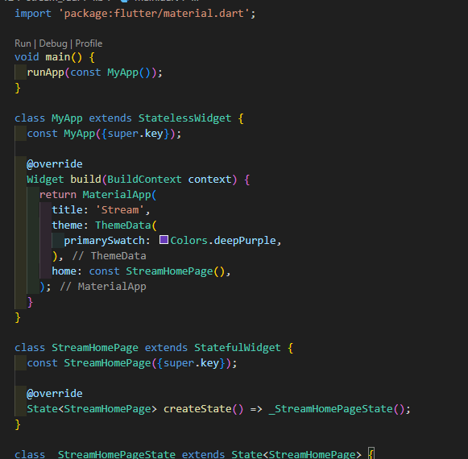
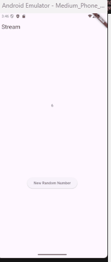

# Lanjutan State Management dengan Streams

**Nama : Raudhil Firdaus Naufal** 

**NIM : 2341720164**  

**Kelas : TI-3G**

# Praktikum 1: Dart Streams

**Langkah 1: Buat Project Baru**

**Langkah 2: Buka file main.dart**

**Soal 1**

**Langkah 3: Buat file baru stream.dart**

**Langkah 4: Tambah variabel colors**

**Soal 2**

**Langkah 5: Tambah method getColors()**

**Langkah 6: Tambah perintah yield***

**Soal 3**

- yield*: Keyword yield* digunakan dalam fungsi generator asinkron (async*) untuk mengembalikan semua elemen dari Stream lain (atau Iterable) secara berturut-turut.

- Maksud Kode: Kode tersebut membuat sebuah Stream yang akan mengeluarkan objek Color dari daftar colors setiap satu detik, mengulanginya dari awal daftar setelah mencapai elemen terakhir.

**Langkah 7: Buka main.dart**

**Langkah 8: Tambah variabel**

**Langkah 9: Tambah method changeColor()**

**Langkah 10: Lakukan override initState()**

**Langkah 11: Ubah isi Scaffold()**

**Langkah 12: Run**

Lakukan running pada aplikasi Flutter Anda, maka akan terlihat berubah warna background setiap detik.

**Soal 4**

**Langkah 13: Ganti isi method changeColor()**

**Soal 5**

- listen: cara berbasis callback yang memungkinkan kode di sekitar terus berjalan 

- await for: dapat digunakan di dalam fungsi async dan akan menangguhkan eksekusi hingga setiap elemen Stream diterima.

# Praktikum 2: Stream controllers dan sinks

**Langkah 1: Buka file stream.dart**

**Langkah 2: Tambah class NumberStream**

**Langkah 3: Tambah StreamController**

**Langkah 4: Tambah method addNumberToSink**

**Langkah 5: Tambah method close()**

**Langkah 6: Buka main.dart**

**Langkah 7: Tambah variabel**

**Langkah 8: Edit initState()**

**Langkah 9: Edit dispose()**

**Langkah 10: Tambah method addRandomNumber()**

**Langkah 11: Edit method build()**

**Langkah 12: Run**

**Soal 6**

- Langkah 8 (initState): Langkah ini menginisialisasi NumberStream dan segera mendaftarkan listener yang akan memperbarui lastNumber (state UI) setiap kali angka baru dikirim ke Stream.

- Langkah 10 (addRandomNumber): Langkah ini membuat angka acak antara 0 hingga 9 (inklusif) dan mengirimkannya ke Sink dari NumberStream melalui metode addNumberToSink.

**Langkah 13: Buka stream.dart**

**Langkah 14: Buka main.dart**

**Langkah 15: Edit method addRandomNumber()**

**Soal 7**

tujuan langkah 13 hingga 15 adalah untuk mengimplementasikan penanganan kesalahan (error handling) pada NumberStream di mana kesalahan dapat dipicu secara manual (addError()) dan ditangkap oleh listener (onError) untuk memperbarui UI (lastNumber = -1).

