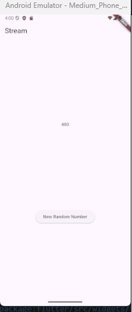
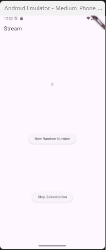
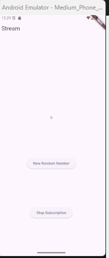

# Lanjutan State Management dengan Streams

**Nama : Raudhil Firdaus Naufal** 

**NIM : 2341720164**  

**Kelas : TI-3G**

# Praktikum 1: Dart Streams

**Langkah 1: Buat Project Baru**

**Langkah 2: Buka file main.dart**

**Soal 1**

**Langkah 3: Buat file baru stream.dart**

**Langkah 4: Tambah variabel colors**

**Soal 2**

**Langkah 5: Tambah method getColors()**

**Langkah 6: Tambah perintah yield***

**Soal 3**

- yield*: Keyword yield* digunakan dalam fungsi generator asinkron (async*) untuk mengembalikan semua elemen dari Stream lain (atau Iterable) secara berturut-turut.

- Maksud Kode: Kode tersebut membuat sebuah Stream yang akan mengeluarkan objek Color dari daftar colors setiap satu detik, mengulanginya dari awal daftar setelah mencapai elemen terakhir.

**Langkah 7: Buka main.dart**

**Langkah 8: Tambah variabel**

**Langkah 9: Tambah method changeColor()**

**Langkah 10: Lakukan override initState()**

**Langkah 11: Ubah isi Scaffold()**

**Langkah 12: Run**

Lakukan running pada aplikasi Flutter Anda, maka akan terlihat berubah warna background setiap detik.

**Soal 4**

**Langkah 13: Ganti isi method changeColor()**

**Soal 5**

- listen: cara berbasis callback yang memungkinkan kode di sekitar terus berjalan 

- await for: dapat digunakan di dalam fungsi async dan akan menangguhkan eksekusi hingga setiap elemen Stream diterima.

# Praktikum 2: Stream controllers dan sinks

**Langkah 1: Buka file stream.dart**

**Langkah 2: Tambah class NumberStream**

**Langkah 3: Tambah StreamController**

**Langkah 4: Tambah method addNumberToSink**

**Langkah 5: Tambah method close()**

**Langkah 6: Buka main.dart**

**Langkah 7: Tambah variabel**

**Langkah 8: Edit initState()**

**Langkah 9: Edit dispose()**

**Langkah 10: Tambah method addRandomNumber()**

**Langkah 11: Edit method build()**

**Langkah 12: Run**

**Soal 6**

- Langkah 8 (initState): Langkah ini menginisialisasi NumberStream dan segera mendaftarkan listener yang akan memperbarui lastNumber (state UI) setiap kali angka baru dikirim ke Stream.

- Langkah 10 (addRandomNumber): Langkah ini membuat angka acak antara 0 hingga 9 (inklusif) dan mengirimkannya ke Sink dari NumberStream melalui metode addNumberToSink.

**Langkah 13: Buka stream.dart**

**Langkah 14: Buka main.dart**

**Langkah 15: Edit method addRandomNumber()**

**Soal 7**

tujuan langkah 13 hingga 15 adalah untuk mengimplementasikan penanganan kesalahan (error handling) pada NumberStream di mana kesalahan dapat dipicu secara manual (addError()) dan ditangkap oleh listener (onError) untuk memperbarui UI (lastNumber = -1).

# Praktikum 3: Injeksi data ke streams

**Langkah 1: Buka main.dart**

**Langkah 2: Tambahkan kode ini di initState**

**Langkah 3: Tetap di initState**

**Langkah 4: Run**

**Soal 8**

Ketiga langkah tersebut berfungsi untuk membuat dan mengaktifkan StreamTransformer yang akan mengalikan nilai angka yang masuk dengan 10 atau mengganti data dengan -1 jika terjadi error, sebelum data tersebut akhirnya didengarkan oleh UI.

# Praktikum 4: Subscribe ke stream events

**Langkah 1: Tambah variabel**

**Langkah 2: Edit initState()**

**Langkah 3: Tetap di initState()**

**Langkah 4: Tambah properti onDone()**

**Langkah 5: Tambah method baru**

**Langkah 6: Pindah ke method dispose()**

**Langkah 7: Pindah ke method build()**

**Langkah 8: Edit method addRandomNumber()**

**Langkah 9: Run**

**Langkah 10: Tekan button ‘Stop Subscription**

**Soal 9**

Ketiga fungsi tersebut secara bersama-sama berfungsi untuk mengatur siklus hidup penuh dari Stream, mulai dari memulai langganan saat widget dibuat, mengirim data secara aman hanya jika Stream aktif, hingga membatalkan langganan saat widget dimusnahkan untuk mencegah kebocoran memori.

# Praktikum 5: Multiple stream subscriptions

**Langkah 1: Buka file main.dart**

**Langkah 2: Edit initState()**

**Langkah 3: Run**

**Soal 10**

Alasan Terjadi error adalah karena kode mencoba listen Stream yang sama lebih dari satu kali (subscription dan subscription2) padahal secara default Stream dari StreamController hanya memperbolehkan satu subscription

**Langkah 4: Set broadcast stream**

**Langkah 5: Edit method build()**

**Langkah 6: Run**

**Soal 11**

Hal itu bisa terjadi karena setiap kali data baru dikirim ke Stream, kedua langganan menerima event yang sama dan masing-masing menambahkan nilai tersebut ke variabel values, sehingga nilainya menumpuk dua kali lipat.

