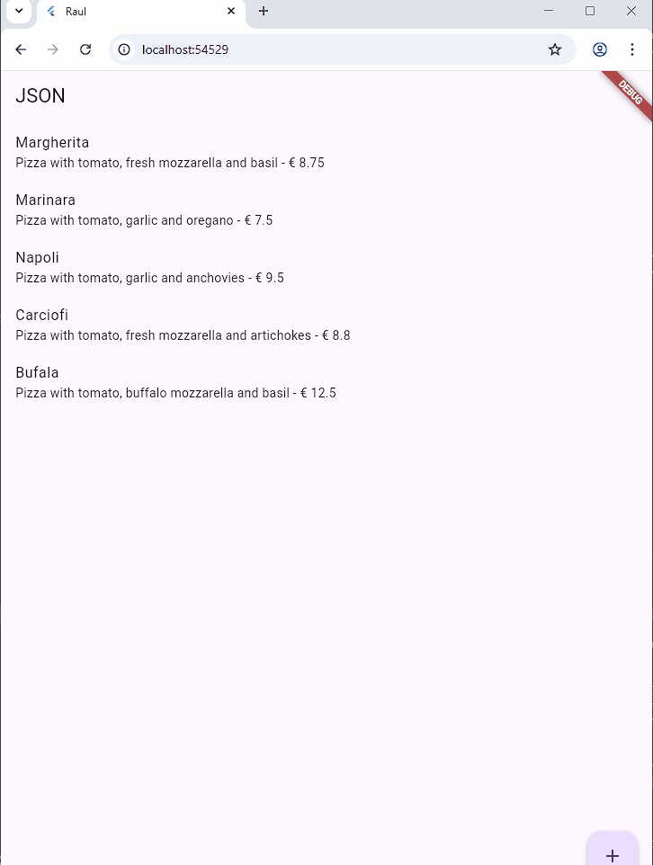
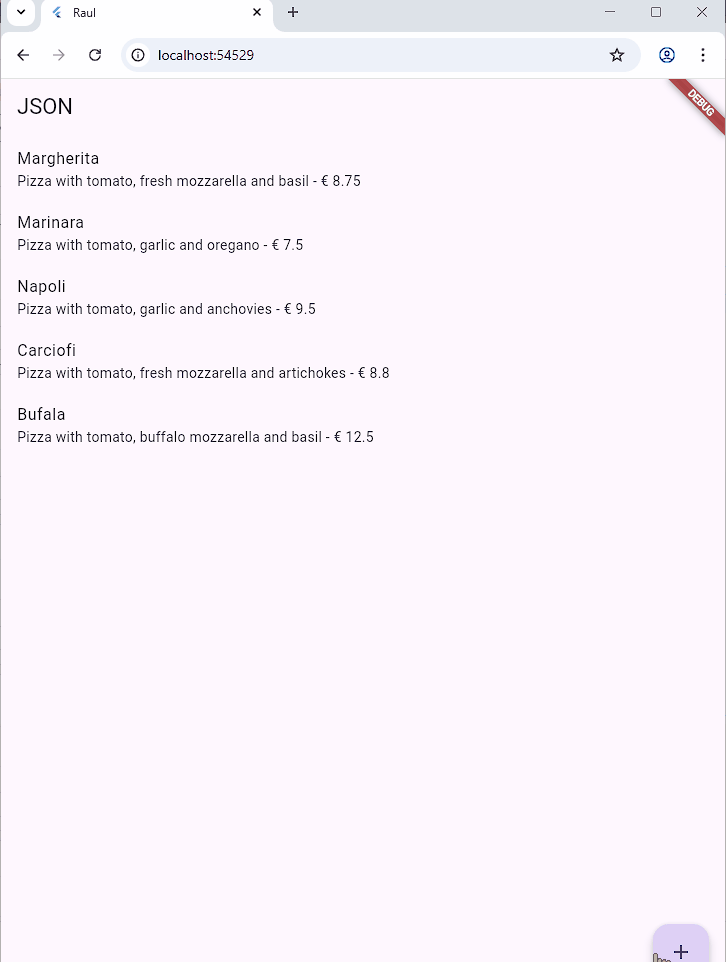
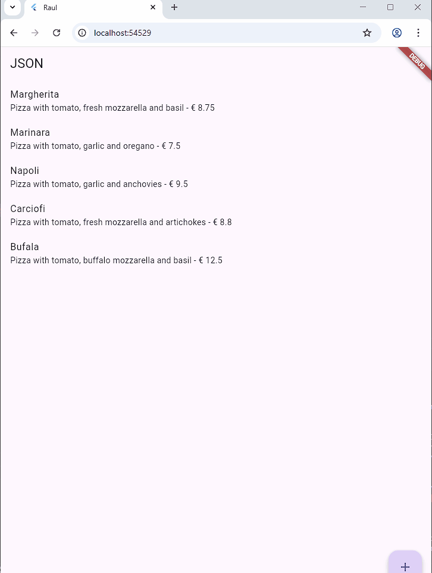

# RESTful API

**Nama : Raudhil Firdaus Naufal** 

**NIM : 2341720164**  

**Kelas : TI-3G**

# **Praktikum 1: Membuat layanan Mock API**

**Soal 1**

Kode pada praktikum 1 melakukan impelemntasi untuk mengambil data daftar pizza dari API eksternal menggunakan package http di Flutter, kemudian menampilkannya dalam sebuah daftar (ListView) menggunakan widget FutureBuilder untuk menangani status asinkronus.

# ** Praktikum 2: Mengirim Data ke Web Service (POST)**

**Soal 2**

Kode-kode pada praktikum 2 berfungsi untuk menambahkan fitur input data pizza baru melalui form yang bisa diakses dari FloatingActionButton, kemudian mengirim data tersebut ke API menggunakan metode POST.

# **Praktikum 3: Memperbarui Data di Web Service (PUT)**

**Soal 3**

Kode-kode pada praktikum 3 berfungsi untuk mengimplementasikan fitur CRUD lengkap Update mengedit pizza existing dengan tap pada ListTile, dan sistem otomatis memilih menggunakan POST atau PUT sesuai konteks operasinya.

# **Praktikum 4: Menghapus Data dari Web Service (DELETE)**

**Soal 4**

Kode-kode pada praktikum 4 mengimplementasikan fitur DELETE dalam CRUD dengan menggunakan widget Dismissible yang memungkinkan user menghapus pizza melalui gesture swipe, kemudian mengirim request DELETE ke API untuk menghapus data dari server secara permanen.

