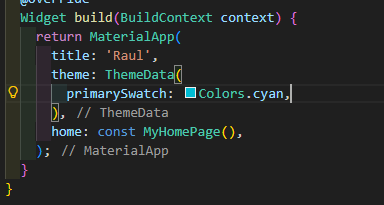

# Persistensi Data

**Nama : Raudhil Firdaus Naufal** 

**NIM : 2341720164**  

**Kelas : TI-3G**

# **Praktikum 1: Konversi Dart model ke JSON**

**Soal 1**

**Hasil:**

Kode-kode pada langkah 1-10 bertujuan untuk memuat data pizza dari file JSON lokal, menyimpannya sebagai String dalam state aplikasi, dan menampilkannya langsung (masih dalam format JSON mentah) di layar aplikasi Flutter setelah widget utama (_MyHomePageState) diinisialisasi.

**Soal 2**

**Hasil**

Kode-kode pada langkah 11-21 berfungsi untuk memuat data JSON mentah, mengonversinya menjadi objek Dart terstruktur (List<Pizza>), dan kemudian menggunakan daftar objek tersebut untuk membangun Widget UI (kemungkinan ListView atau Column) yang menampilkan pizzaName sebagai judul tebal dan description sebagai teks pendukung untuk setiap item, sehingga tampilannya rapi dan terorganisir, bukan lagi sebagai string JSON mentah.

**Soal 3**

**Hasil:**

Fungsi langkah 23-25 adalah melakukan fungsi konversi di mana data JSON di-encode dua kali lipat, menyebabkan tanda kutip di dalam data harus "diloloskan" (escaped) oleh encoder terluar, oleh karena itu muncul di debug console.

# **Praktikum 2: Handle kompatibilitas data JSON**

Saya membuat file paru yaitu pizzalists_broken.json dengan data yang tidka konsisten

**Hasil**

**Soal 4**

Praktikum ini adalah Factory Constructor di Dart yang berfungsi untuk parsing data mentah dari JSON menjadi objek Pizza yang terstruktur dan aman, dengan secara cerdas menangani serta memberikan nilai default yang valid meskipun data JSON yang masuk tidak ada atau tidak konsisten.

# **Praktikum 3: Menangani error JSON**

**Soal 5**

Kode ini dianggap lebih aman karena menggunakan fungsi konversi aman seperti tryParse dan operator null-aware (??) untuk mencegah crash saat data JSON tidak ada atau tidak konsisten, dan lebih maintainable karena menggunakan konstanta static const untuk nama kunci JSON, sehingga perubahan nama kunci hanya perlu dilakukan di satu tempat.

